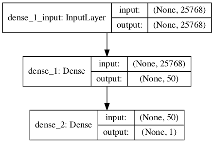
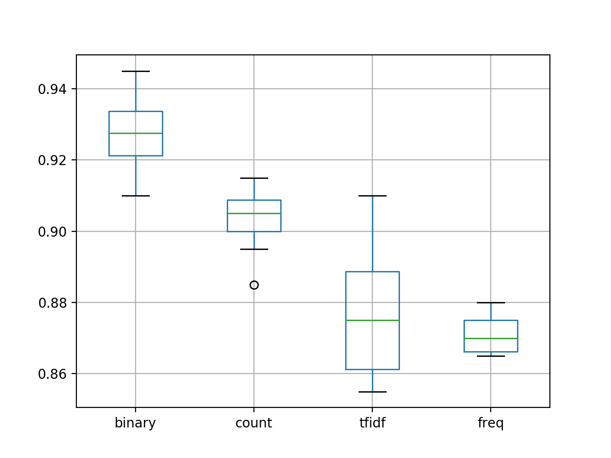

# Project: Develop a Neural Bag-of-Words Model for Sentiment Analysis
Movie reviews can be classified as either favorable or not. The evaluation of movie review text
is a classification problem often called sentiment analysis. A popular technique for developing
sentiment analysis models is to use a bag-of-words model that transforms documents into vectors
where each word in the document is assigned a score. In this tutorial, you will discover how you
can develop a deep learning predictive model using the bag-of-words representation for movie
review sentiment classification. After completing this tutorial, you will know:
- How to prepare the review text data for modeling with a restricted vocabulary.
- How to use the bag-of-words model to prepare train and test data.
- How to develop a Multilayer Perceptron bag-of-words model and use it to make predictions
on new review text data.

Let's get started.

#### Pre-reqs:
- Google Chrome (Recommended)

#### Lab Environment
Notebooks are ready to run. All packages have been installed. There is no requirement for any setup.

**Note:** Elev8ed Notebooks (powered by Jupyter) will be accessible at the port given to you by your instructor. Password for jupyterLab : `1234`

All Notebooks are present in `work/deep-learning-for-nlp` folder.

You can access jupyter lab at `<host-ip>:<port>/lab/workspaces/lab6_Neural_Bag_Words_Model_Sentiment_Analysis`

#### Tutorial Overview

This tutorial is divided into the following parts:
1. Movie Review Dataset
2. Data Preparation
3. Bag-of-Words Representation
4. Sentiment Analysis Models
5. Comparing Word Scoring Methods
6. Predicting Sentiment for New Reviews


# Movie Review Dataset

In this tutorial, we will use the Movie Review Dataset. This dataset designed for sentiment
analysis was described previously . You can download the dataset from here:
- Movie Review Polarity Dataset (review polarity.tar.gz, 3MB).
http://www.cs.cornell.edu/people/pabo/movie-review-data/review_polarity.tar.
gz

After unzipping the file, you will have a directory called txt sentoken with two subdirectories containing the text neg and pos for negative and positive reviews. Reviews are stored
one per file with a naming convention cv000 to cv999 for each of neg and pos. Next, let's look
at loading the text data.

Data Preparation

**Note:**  The preparation of the movie review dataset was first described previously. In this
section, we will look at 3 things:
1. Separation of data into training and test sets.
2. Loading and cleaning the data to remove punctuation and numbers.
3. Defining a vocabulary of preferred words.

### Split into Train and Test Sets

We are pretending that we are developing a system that can predict the sentiment of a textual
movie review as either positive or negative. This means that after the model is developed, we
will need to make predictions on new textual reviews. This will require all of the same data
preparation to be performed on those new reviews as is performed on the training data for the
model.

We will ensure that this constraint is built into the evaluation of our models by splitting the
training and test datasets prior to any data preparation. This means that any knowledge in the
test set that could help us better prepare the data (e.g. the words used) is unavailable during
the preparation of data and the training of the model. That being said, we will use the last 100
positive reviews and the last 100 negative reviews as a test set (100 reviews) and the remaining
1,800 reviews as the training dataset. This is a 90% train, 10% split of the data. The split can
be imposed easily by using the filenames of the reviews where reviews named 000 to 899 are for
training data and reviews named 900 onwards are for testing the model.

### Loading and Cleaning Reviews

The text data is already pretty clean, so not much preparation is required. Without getting too
much into the details, we will prepare the data using the following method:
- Split tokens on white space.

### Data Preparation

- Remove all punctuation from words.
- Remove all words that are not purely comprised of alphabetical characters.
- Remove all words that are known stop words.
- Remove all words that have a length ≤ 1 character.

We can put all of these steps into a function called clean doc() that takes as an argument
the raw text loaded from a file and returns a list of cleaned tokens. We can also define a function
load doc() that loads a document from file ready for use with the clean doc() function. An
example of cleaning the first positive review is listed below.

```
from nltk.corpus import stopwords
import string
import re
# load doc into memory
def load_doc(filename):
# open the file as read only
file = open(filename, 'r')
# read all text
text = file.read()
# close the file
file.close()
return text
# turn a doc into clean tokens
def clean_doc(doc):
# split into tokens by white space
tokens = doc.split()
# prepare regex for char filtering
re_punc = re.compile('[%s]' % re.escape(string.punctuation))
# remove punctuation from each word
tokens = [re_punc.sub('', w) for w in tokens]
# remove remaining tokens that are not alphabetic
tokens = [word for word in tokens if word.isalpha()]
# filter out stop words
stop_words = set(stopwords.words('english'))
tokens = [w for w in tokens if not w in stop_words]
# filter out short tokens
tokens = [word for word in tokens if len(word) > 1]
return tokens
# load the document
filename = 'txt_sentoken/pos/cv000_29590.txt'
text = load_doc(filename)
tokens = clean_doc(text)
print(tokens)

```


##### Run Notebook
Click notebook `1_clean_review.ipynb` in jupterLab UI and run jupyter notebook.

### Exercise
Running the example prints a long list of clean tokens. There are many more cleaning steps
we may want to explore, and I leave them as further exercises. I'd love to see what you can
come up with.

Data Preparation

```
...
'creepy', 'place', 'even', 'acting', 'hell', 'solid', 'dreamy', 'depp', 'turning',
'typically', 'strong', 'performance', 'deftly', 'handling', 'british', 'accent',
'ians', 'holm', 'joe', 'goulds', 'secret', 'richardson', 'dalmatians', 'log', 'great',
'supporting', 'roles', 'big', 'surprise', 'graham', 'cringed', 'first', 'time',
'opened', 'mouth', 'imagining', 'attempt', 'irish', 'accent', 'actually', 'wasnt',
'half', 'bad', 'film', 'however', 'good', 'strong', 'violencegore', 'sexuality',
'language', 'drug', 'content']

```

Define a Vocabulary

It is important to define a vocabulary of known words when using a bag-of-words model. The
more words, the larger the representation of documents, therefore it is important to constrain
the words to only those believed to be predictive. This is difficult to know beforehand and often
it is important to test different hypotheses about how to construct a useful vocabulary. We
have already seen how we can remove punctuation and numbers from the vocabulary in the
previous section. We can repeat this for all documents and build a set of all known words.
We can develop a vocabulary as a Counter, which is a dictionary mapping of words and
their count that allows us to easily update and query. Each document can be added to the
counter (a new function called add doc to vocab()) and we can step over all of the reviews in
the negative directory and then the positive directory (a new function called process docs()).
The complete example is listed below.

```
import string
import re
from os import listdir
from collections import Counter
from nltk.corpus import stopwords
# load doc into memory
def load_doc(filename):
# open the file as read only
file = open(filename, 'r')
# read all text
text = file.read()
# close the file
file.close()
return text
# turn a doc into clean tokens
def clean_doc(doc):
# split into tokens by white space
tokens = doc.split()
# prepare regex for char filtering
re_punc = re.compile('[%s]' % re.escape(string.punctuation))
# remove punctuation from each word
tokens = [re_punc.sub('', w) for w in tokens]
# remove remaining tokens that are not alphabetic
tokens = [word for word in tokens if word.isalpha()]
# filter out stop words
stop_words = set(stopwords.words('english'))
tokens = [w for w in tokens if not w in stop_words]
# filter out short tokens
tokens = [word for word in tokens if len(word) > 1]
return tokens
# load doc and add to vocab
def add_doc_to_vocab(filename, vocab):
# load doc
doc = load_doc(filename)
# clean doc
tokens = clean_doc(doc)
# update counts
vocab.update(tokens)
# load all docs in a directory
def process_docs(directory, vocab):
# walk through all files in the folder
for filename in listdir(directory):
# skip any reviews in the test set
if filename.startswith('cv9'):
continue
# create the full path of the file to open
path = directory + '/' + filename
# add doc to vocab
add_doc_to_vocab(path, vocab)
# define vocab
vocab = Counter()
# add all docs to vocab
process_docs('txt_sentoken/pos', vocab)
process_docs('txt_sentoken/neg', vocab)
# print the size of the vocab
print(len(vocab))
# print the top words in the vocab
print(vocab.most_common(50))

```


##### Run Notebook
Click notebook `2_select_vocab.ipynb` in jupterLab UI and run jupyter notebook.

Running the example shows that we have a vocabulary of 44,276 words. We also can see
a sample of the top 50 most used words in the movie reviews. Note that this vocabulary was
constructed based on only those reviews in the training dataset.

```
44276
[('film', 7983), ('one', 4946), ('movie', 4826), ('like', 3201), ('even', 2262), ('good',
2080), ('time', 2041), ('story', 1907), ('films', 1873), ('would', 1844), ('much',
1824), ('also', 1757), ('characters', 1735), ('get', 1724), ('character', 1703),
('two', 1643), ('first', 1588), ('see', 1557), ('way', 1515), ('well', 1511), ('make',
1418), ('really', 1407), ('little', 1351), ('life', 1334), ('plot', 1288), ('people',
1269), ('could', 1248), ('bad', 1248), ('scene', 1241), ('movies', 1238), ('never',
1201), ('best', 1179), ('new', 1140), ('scenes', 1135), ('man', 1131), ('many', 1130),
('doesnt', 1118), ('know', 1092), ('dont', 1086), ('hes', 1024), ('great', 1014),
('another', 992), ('action', 985), ('love', 977), ('us', 967), ('go', 952),
('director', 948), ('end', 946), ('something', 945), ('still', 936)]
```

Data Preparation

We can step through the vocabulary and remove all words that have a low occurrence, such
as only being used once or twice in all reviews. For example, the following snippet will retrieve
only the tokens that appear 2 or more times in all reviews.

```
# keep tokens with a min occurrence
min_occurrence = 2
tokens = [k for k,c in vocab.items() if c >= min_occurrence]
print(len(tokens))

```

Finally, the vocabulary can be saved to a new file called vocab.txt that we can later load
and use to filter movie reviews prior to encoding them for modeling. We define a new function
called save list() that saves the vocabulary to file, with one word per line. For example:

```
# save list to file
def save_list(lines, filename):
# convert lines to a single blob of text
data = '\n'.join(lines)
# open file
file = open(filename, 'w')
# write text
file.write(data)
# close file
file.close()
# save tokens to a vocabulary file
save_list(tokens, 'vocab.txt')

```

Pulling all of this together, the complete example is listed below.

```
import string
import re
from os import listdir
from collections import Counter
from nltk.corpus import stopwords
# load doc into memory
def load_doc(filename):
# open the file as read only
file = open(filename, 'r')
# read all text
text = file.read()
# close the file
file.close()
return text
# turn a doc into clean tokens
def clean_doc(doc):
# split into tokens by white space
tokens = doc.split()
# prepare regex for char filtering
re_punc = re.compile('[%s]' % re.escape(string.punctuation))
# remove punctuation from each word
tokens = [re_punc.sub('', w) for w in tokens]
# remove remaining tokens that are not alphabetic
tokens = [word for word in tokens if word.isalpha()]
# filter out stop words
stop_words = set(stopwords.words('english'))
tokens = [w for w in tokens if not w in stop_words]
# filter out short tokens
tokens = [word for word in tokens if len(word) > 1]
return tokens
# load doc and add to vocab
def add_doc_to_vocab(filename, vocab):
# load doc
doc = load_doc(filename)
# clean doc
tokens = clean_doc(doc)
# update counts
vocab.update(tokens)
# load all docs in a directory
def process_docs(directory, vocab):
# walk through all files in the folder
for filename in listdir(directory):
# skip any reviews in the test set
if filename.startswith('cv9'):
continue
# create the full path of the file to open
path = directory + '/' + filename
# add doc to vocab
add_doc_to_vocab(path, vocab)
# save list to file
def save_list(lines, filename):
# convert lines to a single blob of text
data = '\n'.join(lines)
# open file
file = open(filename, 'w')
# write text
file.write(data)
# close file
file.close()
# define vocab
vocab = Counter()
# add all docs to vocab
process_docs('txt_sentoken/pos', vocab)
process_docs('txt_sentoken/neg', vocab)
# print the size of the vocab
print(len(vocab))
# keep tokens with a min occurrence
min_occurrence = 2
tokens = [k for k,c in vocab.items() if c >= min_occurrence]
print(len(tokens))
# save tokens to a vocabulary file
save_list(tokens, 'vocab.txt')

```


##### Run Notebook
Click notebook `3_filter_vocab.ipynb` in jupterLab UI and run jupyter notebook.

### Bag-of-Words Representation

Running the above example with this addition shows that the vocabulary size drops by a
little more than half its size, from about 44,000 to about 25,000 words.

```
25767
```

Running the min occurrence filter on the vocabulary and saving it to file, you should now
have a new file called vocab.txt with only the words we are interested in.
The order of words in your file will differ, but should look something like the following:

```
aberdeen
dupe
burt
libido
hamlet
arlene
available
corners
web
columbia
...

```

We are now ready to look at extracting features from the reviews ready for modeling.

10.4

Bag-of-Words Representation

In this section, we will look at how we can convert each review into a representation that we
can provide to a Multilayer Perceptron model. A bag-of-words model is a way of extracting
features from text so the text input can be used with machine learning algorithms like neural
networks. Each document, in this case a review, is converted into a vector representation.
The number of items in the vector representing a document corresponds to the number of
words in the vocabulary. The larger the vocabulary, the longer the vector representation, hence
the preference for smaller vocabularies in the previous section. The bag-of-words model was
introduced previously in Chapter 8.
Words in a document are scored and the scores are placed in the corresponding location in
the representation. We will look at different word scoring methods in the next section. In this
section, we are concerned with converting reviews into vectors ready for training a first neural
network model. This section is divided into 2 steps:
1. Converting reviews to lines of tokens.
2. Encoding reviews with a bag-of-words model representation.

### Reviews to Lines of Tokens

Before we can convert reviews to vectors for modeling, we must first clean them up. This
involves loading them, performing the cleaning operation developed above, filtering out words
not in the chosen vocabulary, and converting the remaining tokens into a single string or line
ready for encoding. First, we need a function to prepare one document. Below lists the function
doc to line() that will load a document, clean it, filter out tokens not in the vocabulary, then
return the document as a string of white space separated tokens.

```
# load doc, clean and return line of tokens
def doc_to_line(filename, vocab):
# load the doc
doc = load_doc(filename)
# clean doc
tokens = clean_doc(doc)
# filter by vocab
tokens = [w for w in tokens if w in vocab]
return ' '.join(tokens)
```

Next, we need a function to work through all documents in a directory (such as pos and
neg) to convert the documents into lines. Below lists the process docs() function that does
just this, expecting a directory name and a vocabulary set as input arguments and returning a
list of processed documents.

```
# load all docs in a directory
def process_docs(directory, vocab):
lines = list()
# walk through all files in the folder
for filename in listdir(directory):
# skip any reviews in the test set
if filename.startswith('cv9'):
continue
# create the full path of the file to open
path = directory + '/' + filename
# load and clean the doc
line = doc_to_line(path, vocab)
# add to list
lines.append(line)
return lines

```

We can call the process docs() consistently for positive and negative reviews to construct
a dataset of review text and their associated output labels, 0 for negative and 1 for positive.
The load clean dataset() function below implements this behavior.

```
# load and clean a dataset
def load_clean_dataset(vocab):
# load documents
neg = process_docs('txt_sentoken/neg', vocab)
pos = process_docs('txt_sentoken/pos', vocab)
docs = neg + pos
# prepare labels
labels = [0 for _ in range(len(neg))] + [1 for _ in range(len(pos))]
return docs, labels

```

Finally, we need to load the vocabulary and turn it into a set for use in cleaning reviews.

Bag-of-Words Representation

```
# load the vocabulary
vocab_filename = 'vocab.txt'
vocab = load_doc(vocab_filename)
vocab = set(vocab.split())

```

We can put all of this together, reusing the loading and cleaning functions developed in
previous sections. The complete example is listed below, demonstrating how to prepare the
positive and negative reviews from the training dataset.

```
import string
import re
from os import listdir
from nltk.corpus import stopwords
# load doc into memory
def load_doc(filename):
# open the file as read only
file = open(filename, 'r')
# read all text
text = file.read()
# close the file
file.close()
return text
# turn a doc into clean tokens
def clean_doc(doc):
# split into tokens by white space
tokens = doc.split()
# prepare regex for char filtering
re_punc = re.compile('[%s]' % re.escape(string.punctuation))
# remove punctuation from each word
tokens = [re_punc.sub('', w) for w in tokens]
# remove remaining tokens that are not alphabetic
tokens = [word for word in tokens if word.isalpha()]
# filter out stop words
stop_words = set(stopwords.words('english'))
tokens = [w for w in tokens if not w in stop_words]
# filter out short tokens
tokens = [word for word in tokens if len(word) > 1]
return tokens
# load doc, clean and return line of tokens
def doc_to_line(filename, vocab):
# load the doc
doc = load_doc(filename)
# clean doc
tokens = clean_doc(doc)
# filter by vocab
tokens = [w for w in tokens if w in vocab]
return ' '.join(tokens)
# load all docs in a directory
def process_docs(directory, vocab):
lines = list()
# walk through all files in the folder
for filename in listdir(directory):
# skip any reviews in the test set
if filename.startswith('cv9'):
continue
# create the full path of the file to open
path = directory + '/' + filename
# load and clean the doc
line = doc_to_line(path, vocab)
# add to list
lines.append(line)
return lines
# load and clean a dataset
def load_clean_dataset(vocab):
# load documents
neg = process_docs('txt_sentoken/neg', vocab)
pos = process_docs('txt_sentoken/pos', vocab)
docs = neg + pos
# prepare labels
labels = [0 for _ in range(len(neg))] + [1 for _ in range(len(pos))]
return docs, labels
# load the vocabulary
vocab_filename = 'vocab.txt'
vocab = load_doc(vocab_filename)
vocab = vocab.split()
vocab = set(vocab)
# load all training reviews
docs, labels = load_clean_dataset(vocab)
# summarize what we have
print(len(docs), len(labels))

```


##### Run Notebook
Click notebook `4_filter_all_reviews.ipynb` in jupterLab UI and run jupyter notebook.

Running this example loads and cleans the review text and returns the labels.

```
1800 1800
```

Movie Reviews to Bag-of-Words Vectors

We will use the Keras API to convert reviews to encoded document vectors. Keras provides
the Tokenizer class that can do some of the cleaning and vocab definition tasks that we took
care of in the previous section. It is better to do this ourselves to know exactly what was done
and why. Nevertheless, the Tokenizer class is convenient and will easily transform documents
into encoded vectors. First, the Tokenizer must be created, then fit on the text documents
in the training dataset. In this case, these are the aggregation of the positive lines and
negative lines arrays developed in the previous section.

```
# fit a tokenizer
def create_tokenizer(lines):
tokenizer = Tokenizer()
tokenizer.fit_on_texts(lines)
return tokenizer

```

This process determines a consistent way to convert the vocabulary to a fixed-length vector
with 25,768 elements, which is the total number of words in the vocabulary file vocab.txt.
Next, documents can then be encoded using the Tokenizer by calling texts to matrix(). The
function takes both a list of documents to encode and an encoding mode, which is the method
used to score words in the document. Here we specify freq to score words based on their
frequency in the document. This can be used to encode the loaded training and test data, for
example:

```
# encode data
Xtrain = tokenizer.texts_to_matrix(train_docs, mode='freq')
Xtest = tokenizer.texts_to_matrix(test_docs, mode='freq')

```

This encodes all of the positive and negative reviews in the training dataset.
Next, the process docs() function from the previous section needs to be modified to
selectively process reviews in the test or train dataset. We support the loading of both the
training and test datasets by adding an is train argument and using that to decide what
review file names to skip.

```
# load all docs in a directory
def process_docs(directory, vocab, is_train):
lines = list()
# walk through all files in the folder
for filename in listdir(directory):
# skip any reviews in the test set
if is_train and filename.startswith('cv9'):
continue
if not is_train and not filename.startswith('cv9'):
con0tinue
# create the full path of the file to open
path = directory + '/' + filename
# load and clean the doc
line = doc_to_line(path, vocab)
# add to list
lines.append(line)
return lines

```

Similarly, the load clean dataset() dataset must be updated to load either train or test
data and ensure it returns an NumPy array.


```
# load and clean a dataset
def load_clean_dataset(vocab, is_train):
# load documents
neg = process_docs('txt_sentoken/neg', vocab, is_train)
pos = process_docs('txt_sentoken/pos', vocab, is_train)
docs = neg + pos
# prepare labels
labels = array([0 for _ in range(len(neg))] + [1 for _ in range(len(pos))])

Bag-of-Words Representation
return docs, labels

```

We can put all of this together in a single example.


```
import string
import re
from os import listdir
from numpy import array
from nltk.corpus import stopwords
from keras.preprocessing.text import Tokenizer
# load doc into memory
def load_doc(filename):
# open the file as read only
file = open(filename, 'r')
# read all text
text = file.read()
# close the file
file.close()
return text
# turn a doc into clean tokens
def clean_doc(doc):
# split into tokens by white space
tokens = doc.split()
# prepare regex for char filtering
re_punc = re.compile('[%s]' % re.escape(string.punctuation))
# remove punctuation from each word
tokens = [re_punc.sub('', w) for w in tokens]
# remove remaining tokens that are not alphabetic
tokens = [word for word in tokens if word.isalpha()]
# filter out stop words
stop_words = set(stopwords.words('english'))
tokens = [w for w in tokens if not w in stop_words]
# filter out short tokens
tokens = [word for word in tokens if len(word) > 1]
return tokens
# load doc, clean and return line of tokens
def doc_to_line(filename, vocab):
# load the doc
doc = load_doc(filename)
# clean doc
tokens = clean_doc(doc)
# filter by vocab
tokens = [w for w in tokens if w in vocab]
return ' '.join(tokens)
# load all docs in a directory
def process_docs(directory, vocab, is_train):
lines = list()
# walk through all files in the folder
for filename in listdir(directory):
# skip any reviews in the test set
if is_train and filename.startswith('cv9'):
continue
if not is_train and not filename.startswith('cv9'):
continue
# create the full path of the file to open
path = directory + '/' + filename
# load and clean the doc
line = doc_to_line(path, vocab)
# add to list
lines.append(line)
return lines
# load and clean a dataset
def load_clean_dataset(vocab, is_train):
# load documents
neg = process_docs('txt_sentoken/neg', vocab, is_train)
pos = process_docs('txt_sentoken/pos', vocab, is_train)
docs = neg + pos
# prepare labels
labels = array([0 for _ in range(len(neg))] + [1 for _ in range(len(pos))])
return docs, labels
# fit a tokenizer
def create_tokenizer(lines):
tokenizer = Tokenizer()
tokenizer.fit_on_texts(lines)
return tokenizer
# load the vocabulary
vocab_filename = 'vocab.txt'
vocab = load_doc(vocab_filename)
vocab = set(vocab.split())
# load all reviews
train_docs, ytrain = load_clean_dataset(vocab, True)
test_docs, ytest = load_clean_dataset(vocab, False)
# create the tokenizer
tokenizer = create_tokenizer(train_docs)
# encode data
Xtrain = tokenizer.texts_to_matrix(train_docs, mode='freq')
Xtest = tokenizer.texts_to_matrix(test_docs, mode='freq')
print(Xtrain.shape, Xtest.shape)

```


##### Run Notebook
Click notebook `5_prepare_data.ipynb` in jupterLab UI and run jupyter notebook.

Running the example prints both the shape of the encoded training dataset and test dataset
with 1,800 and 200 documents respectively, each with the same sized encoding vocabulary
(vector length).

```
(1800, 25768) (200, 25768)

```

Sentiment Analysis Models

In this section, we will develop Multilayer Perceptron (MLP) models to classify encoded
documents as either positive or negative. The models will be simple feedforward network models
with fully connected layers called Dense in the Keras deep learning library. This section is
divided into 3 sections:
1. First sentiment analysis model
2. Comparing word scoring modes
3. Making a prediction for new reviews

First Sentiment Analysis Model

We can develop a simple MLP model to predict the sentiment of encoded reviews. The model
will have an input layer that equals the number of words in the vocabulary, and in turn the
length of the input documents. We can store this in a new variable called n words, as follows:

```
n_words = Xtest.shape[1]

```

We can now define the network. All model configuration was found with very little trial and
error and should not be considered tuned for this problem. We will use a single hidden layer
with 50 neurons and a rectified linear activation function. The output layer is a single neuron
with a sigmoid activation function for predicting 0 for negative and 1 for positive reviews. The
network will be trained using the efficient Adam implementation of gradient descent and the
binary cross entropy loss function, suited to binary classification problems. We will keep track
of accuracy when training and evaluating the model.

```
# define the model
def define_model(n_words):
# define network
model = Sequential()
model.add(Dense(50, input_shape=(n_words,), activation='relu'))
model.add(Dense(1, activation='sigmoid'))
# compile network
model.compile(loss='binary_crossentropy', optimizer='adam', metrics=['accuracy'])
# summarize defined model
model.summary()
plot_model(model, to_file='model.png', show_shapes=True)
return model

```

Next, we can fit the model on the training data; in this case, the model is small and is easily
fit in 10 epochs.

```
# fit network
model.fit(Xtrain, ytrain, epochs=10, verbose=2)

```

Finally, once the model is trained, we can evaluate its performance by making predictions in
the test dataset and printing the accuracy.

Sentiment Analysis Models

```
# evaluate
loss, acc = model.evaluate(Xtest, ytest, verbose=0)
print('Test Accuracy: %f' % (acc*100))

```

The complete example is listed below.

```
import string
import re
from os import listdir
from numpy import array
from nltk.corpus import stopwords
from keras.preprocessing.text import Tokenizer
from keras.utils.vis_utils import plot_model
from keras.models import Sequential
from keras.layers import Dense
# load doc into memory
def load_doc(filename):
# open the file as read only
file = open(filename, 'r')
# read all text
text = file.read()
# close the file
file.close()
return text
# turn a doc into clean tokens
def clean_doc(doc):
# split into tokens by white space
tokens = doc.split()
# prepare regex for char filtering
re_punc = re.compile('[%s]' % re.escape(string.punctuation))
# remove punctuation from each word
tokens = [re_punc.sub('', w) for w in tokens]
# remove remaining tokens that are not alphabetic
tokens = [word for word in tokens if word.isalpha()]
# filter out stop words
stop_words = set(stopwords.words('english'))
tokens = [w for w in tokens if not w in stop_words]
# filter out short tokens
tokens = [word for word in tokens if len(word) > 1]
return tokens
# load doc, clean and return line of tokens
def doc_to_line(filename, vocab):
# load the doc
doc = load_doc(filename)
# clean doc
tokens = clean_doc(doc)
# filter by vocab
tokens = [w for w in tokens if w in vocab]
return ' '.join(tokens)
# load all docs in a directory
def process_docs(directory, vocab, is_train):
lines = list()
# walk through all files in the folder
for filename in listdir(directory):
# skip any reviews in the test set
if is_train and filename.startswith('cv9'):
continue
if not is_train and not filename.startswith('cv9'):
continue
# create the full path of the file to open
path = directory + '/' + filename
# load and clean the doc
line = doc_to_line(path, vocab)
# add to list
lines.append(line)
return lines
# load and clean a dataset
def load_clean_dataset(vocab, is_train):
# load documents
neg = process_docs('txt_sentoken/neg', vocab, is_train)
pos = process_docs('txt_sentoken/pos', vocab, is_train)
docs = neg + pos
# prepare labels
labels = array([0 for _ in range(len(neg))] + [1 for _ in range(len(pos))])
return docs, labels
# fit a tokenizer
def create_tokenizer(lines):
tokenizer = Tokenizer()
tokenizer.fit_on_texts(lines)
return tokenizer
# define the model
def define_model(n_words):
# define network
model = Sequential()
model.add(Dense(50, input_shape=(n_words,), activation='relu'))
model.add(Dense(1, activation='sigmoid'))
# compile network
model.compile(loss='binary_crossentropy', optimizer='adam', metrics=['accuracy'])
# summarize defined model
model.summary()
plot_model(model, to_file='model.png', show_shapes=True)
return model
# load the vocabulary
vocab_filename = 'vocab.txt'
vocab = load_doc(vocab_filename)
vocab = set(vocab.split())
# load all reviews
train_docs, ytrain = load_clean_dataset(vocab, True)
test_docs, ytest = load_clean_dataset(vocab, False)
# create the tokenizer
tokenizer = create_tokenizer(train_docs)
# encode data
Xtrain = tokenizer.texts_to_matrix(train_docs, mode='freq')
Xtest = tokenizer.texts_to_matrix(test_docs, mode='freq')
# define the model
n_words = Xtest.shape[1]
model = define_model(n_words)
# fit network
model.fit(Xtrain, ytrain, epochs=10, verbose=2)
# evaluate
loss, acc = model.evaluate(Xtest, ytest, verbose=0)
print('Test Accuracy: %f' % (acc*100))

```

##### Run Notebook
Click notebook `6_mlp_bow_model.ipynb` in jupterLab UI and run jupyter notebook.

Running the example first prints a summary of the defined model.

```
_________________________________________________________________
Layer (type)
Output Shape
Param #
=================================================================
dense_1 (Dense)
(None, 50)
1288450
_________________________________________________________________
dense_2 (Dense)
(None, 1)
51
=================================================================
Total params: 1,288,501
Trainable params: 1,288,501
Non-trainable params: 0
_________________________________________________________________

```

A plot the defined model is then saved to file with the name model.png.



We can see that the model easily fits the training data within the 10 epochs, achieving close
to 100% accuracy. Evaluating the model on the test dataset, we can see that model does well,
achieving an accuracy of above 87%, well within the ballpark of low-to-mid 80s seen in the
original paper. Although, it is important to note that this is not an apples-to-apples comparison,
as the original paper used 10-fold cross-validation to estimate model skill instead of a single
train/test split.

**Note:**  Given the stochastic nature of neural networks, your specific results may vary. Consider
running the example a few times.

```
...
Epoch 6/10
0s - loss: 0.5319
Epoch 7/10
0s - loss: 0.4839
Epoch 8/10
0s - loss: 0.4368
Epoch 9/10
0s - loss: 0.3927
Epoch 10/10
0s - loss: 0.3516

- acc: 0.9428
- acc: 0.9506
- acc: 0.9567
- acc: 0.9611
- acc: 0.9689

Test Accuracy: 87.000000

```

Next, let's look at testing different word scoring methods for the bag-of-words model.

#### Comparing Word Scoring Methods

The texts to matrix() function for the Tokenizer in the Keras API provides 4 different
methods for scoring words; they are:
- binary Where words are marked as present (1) or absent (0).
- count Where the occurrence count for each word is marked as an integer.
- tfidf Where each word is scored based on their frequency, where words that are common
across all documents are penalized.
- freq Where words are scored based on their frequency of occurrence within the document.

We can evaluate the skill of the model developed in the previous section fit using each of the
4 supported word scoring modes. This first involves the development of a function to create an
encoding of the loaded documents based on a chosen scoring model. The function creates the
tokenizer, fits it on the training documents, then creates the train and test encodings using the
chosen model. The function prepare data() implements this behavior given lists of train and
test documents.

```
# prepare bag-of-words encoding of docs
def prepare_data(train_docs, test_docs, mode):
# create the tokenizer
tokenizer = Tokenizer()
# fit the tokenizer on the documents
tokenizer.fit_on_texts(train_docs)
# encode training data set
Xtrain = tokenizer.texts_to_matrix(train_docs, mode=mode)
# encode training data set
Xtest = tokenizer.texts_to_matrix(test_docs, mode=mode)
return Xtrain, Xtest

```

We also need a function to evaluate the MLP given a specific encoding of the data. Because
neural networks are stochastic, they can produce different results when the same model is fit on
the same data. This is mainly because of the random initial weights and the shuffling of patterns
during mini-batch gradient descent. This means that any one scoring of a model is unreliable
and we should estimate model skill based on an average of multiple runs. The function below,
named evaluate mode(), takes encoded documents and evaluates the MLP by training it on
the train set and estimating skill on the test set 10 times and returns a list of the accuracy
scores across all of these runs.

```
# evaluate a neural network model
def evaluate_mode(Xtrain, ytrain, Xtest, ytest):
scores = list()
n_repeats = 30
n_words = Xtest.shape[1]
for i in range(n_repeats):
# define network
model = Sequential()
model.add(Dense(50, input_shape=(n_words,), activation='relu'))
model.add(Dense(1, activation='sigmoid'))
# compile network
model.compile(loss='binary_crossentropy', optimizer='adam', metrics=['accuracy'])
# fit network
model.fit(Xtrain, ytrain, epochs=10, verbose=2)
# evaluate
loss, acc = model.evaluate(Xtest, ytest, verbose=0)
scores.append(acc)
print('%d accuracy: %s' % ((i+1), acc))
return scores

```

We are now ready to evaluate the performance of the 4 different word scoring methods.
Pulling all of this together, the complete example is listed below.

```
import string
import re
from os import listdir
from numpy import array
from nltk.corpus import stopwords
from keras.preprocessing.text import Tokenizer
from keras.models import Sequential
from keras.layers import Dense
from pandas import DataFrame
from matplotlib import pyplot
# load doc into memory
def load_doc(filename):
# open the file as read only
file = open(filename, 'r')
# read all text
text = file.read()
# close the file
file.close()
return text
# turn a doc into clean tokens
def clean_doc(doc):
# split into tokens by white space
tokens = doc.split()
# prepare regex for char filtering
re_punc = re.compile('[%s]' % re.escape(string.punctuation))
# remove punctuation from each word
tokens = [re_punc.sub('', w) for w in tokens]
# remove remaining tokens that are not alphabetic
tokens = [word for word in tokens if word.isalpha()]
# filter out stop words
stop_words = set(stopwords.words('english'))
tokens = [w for w in tokens if not w in stop_words]
# filter out short tokens
tokens = [word for word in tokens if len(word) > 1]
return tokens
# load doc, clean and return line of tokens
def doc_to_line(filename, vocab):
# load the doc
doc = load_doc(filename)
# clean doc
tokens = clean_doc(doc)
# filter by vocab
tokens = [w for w in tokens if w in vocab]
return ' '.join(tokens)
# load all docs in a directory
def process_docs(directory, vocab, is_train):
lines = list()
# walk through all files in the folder
for filename in listdir(directory):
# skip any reviews in the test set
if is_train and filename.startswith('cv9'):
continue
if not is_train and not filename.startswith('cv9'):
continue
# create the full path of the file to open
path = directory + '/' + filename
# load and clean the doc
line = doc_to_line(path, vocab)
# add to list
lines.append(line)
return lines
# load and clean a dataset
def load_clean_dataset(vocab, is_train):
# load documents
neg = process_docs('txt_sentoken/neg', vocab, is_train)
pos = process_docs('txt_sentoken/pos', vocab, is_train)
docs = neg + pos
# prepare labels
labels = array([0 for _ in range(len(neg))] + [1 for _ in range(len(pos))])
return docs, labels
# define the model
def define_model(n_words):
# define network
model = Sequential()
model.add(Dense(50, input_shape=(n_words,), activation='relu'))
model.add(Dense(1, activation='sigmoid'))
# compile network
model.compile(loss='binary_crossentropy', optimizer='adam', metrics=['accuracy'])
return model
# evaluate a neural network model
def evaluate_mode(Xtrain, ytrain, Xtest, ytest):
scores = list()
n_repeats = 10
n_words = Xtest.shape[1]
for i in range(n_repeats):
# define network
model = define_model(n_words)
# fit network
model.fit(Xtrain, ytrain, epochs=10, verbose=0)
# evaluate
_, acc = model.evaluate(Xtest, ytest, verbose=0)
scores.append(acc)
print('%d accuracy: %s' % ((i+1), acc))
return scores
# prepare bag of words encoding of docs
def prepare_data(train_docs, test_docs, mode):
# create the tokenizer
tokenizer = Tokenizer()
# fit the tokenizer on the documents
tokenizer.fit_on_texts(train_docs)
# encode training data set
Xtrain = tokenizer.texts_to_matrix(train_docs, mode=mode)
# encode training data set
Xtest = tokenizer.texts_to_matrix(test_docs, mode=mode)
return Xtrain, Xtest
# load the vocabulary
vocab_filename = 'vocab.txt'
vocab = load_doc(vocab_filename)
vocab = set(vocab.split())
# load all reviews
train_docs, ytrain = load_clean_dataset(vocab, True)
test_docs, ytest = load_clean_dataset(vocab, False)
# run experiment
modes = ['binary', 'count', 'tfidf', 'freq']
results = DataFrame()
for mode in modes:
# prepare data for mode
Xtrain, Xtest = prepare_data(train_docs, test_docs, mode)
# evaluate model on data for mode
results[mode] = evaluate_mode(Xtrain, ytrain, Xtest, ytest)
# summarize results
print(results.describe())
# plot results
results.boxplot()
pyplot.show()

```

##### Run Notebook
Click notebook `7_compare_encodings.ipynb` in jupterLab UI and run jupyter notebook.


At the end of the run, summary statistics for each word scoring method are provided,
summarizing the distribution of model skill scores across each of the 10 runs per mode. We can
see that the mean score of both the count and binary methods appear to be better than freq
and tfidf.
**Note:**  Given the stochastic nature of neural networks, your specific results may vary. Consider
running the example a few times.

```
binary
count
tfidf
freq
count 10.000000 10.000000 10.000000 10.000000
mean
0.927000 0.903500 0.876500 0.871000
std
0.011595 0.009144 0.017958 0.005164
min
0.910000 0.885000 0.855000 0.865000
25%
0.921250 0.900000 0.861250 0.866250
50%
0.927500 0.905000 0.875000 0.870000
75%
0.933750 0.908750 0.888750 0.875000
max
0.945000 0.915000 0.910000 0.880000

```

A box and whisker plot of the results is also presented, summarizing the accuracy distributions
per configuration. We can see that binary achieved the best results with a modest spread and
might be the preferred approach for this dataset.



# Predicting Sentiment for New Reviews

Finally, we can develop and use a final model to make predictions for new textual reviews. This
is why we wanted the model in the first place. First we will train a final model on all of the
available data. We will use the binary mode for scoring the bag-of-words model that was shown
to give the best results in the previous section.
Predicting the sentiment of new reviews involves following the same steps used to prepare
the test data. Specifically, loading the text, cleaning the document, filtering tokens by the
chosen vocabulary, converting the remaining tokens to a line, encoding it using the Tokenizer,
and making a prediction. We can make a prediction of a class value directly with the fit model
by calling predict() that will return an integer of 0 for a negative review and 1 for a positive
review. All of these steps can be put into a new function called predict sentiment() that
requires the review text, the vocabulary, the tokenizer, and the fit model and returns the
predicted sentiment and an associated percentage or confidence-like output.

```
# classify a review as negative or positive
def predict_sentiment(review, vocab, tokenizer, model):
# clean
tokens = clean_doc(review)
# filter by vocab
tokens = [w for w in tokens if w in vocab]
# convert to line
line = ' '.join(tokens)
# encode
encoded = tokenizer.texts_to_matrix([line], mode='binary')
# predict sentiment
yhat = model.predict(encoded, verbose=0)
# retrieve predicted percentage and label
percent_pos = yhat[0,0]
if round(percent_pos) == 0:
return (1-percent_pos), 'NEGATIVE'
return percent_pos, 'POSITIVE'

```

We can now make predictions for new review texts. Below is an example with both a clearly
positive and a clearly negative review using the simple MLP developed above with the frequency
word scoring mode.

```
# test positive text
text = 'Best movie ever! It was great, I recommend it.'
percent, sentiment = predict_sentiment(text, vocab, tokenizer, model)
print('Review: [%s]\nSentiment: %s (%.3f%%)' % (text, sentiment, percent*100))
# test negative text
text = 'This is a bad movie.'
percent, sentiment = predict_sentiment(text, vocab, tokenizer, model)
print('Review: [%s]\nSentiment: %s (%.3f%%)' % (text, sentiment, percent*100))

```

Pulling this all together, the complete example for making predictions for new reviews is
listed below.

```
import string
import re
from os import listdir
from numpy import array
from nltk.corpus import stopwords
from keras.preprocessing.text import Tokenizer
from keras.utils.vis_utils import plot_model
from keras.models import Sequential
from keras.layers import Dense
# load doc into memory
def load_doc(filename):
# open the file as read only
file = open(filename, 'r')
# read all text
text = file.read()
# close the file
file.close()
return text
# turn a doc into clean tokens
def clean_doc(doc):
# split into tokens by white space
tokens = doc.split()

Predicting Sentiment for New Reviews
# prepare regex for char filtering
re_punc = re.compile('[%s]' % re.escape(string.punctuation))
# remove punctuation from each word
tokens = [re_punc.sub('', w) for w in tokens]
# remove remaining tokens that are not alphabetic
tokens = [word for word in tokens if word.isalpha()]
# filter out stop words
stop_words = set(stopwords.words('english'))
tokens = [w for w in tokens if not w in stop_words]
# filter out short tokens
tokens = [word for word in tokens if len(word) > 1]
return tokens
# load doc, clean and return line of tokens
def doc_to_line(filename, vocab):
# load the doc
doc = load_doc(filename)
# clean doc
tokens = clean_doc(doc)
# filter by vocab
tokens = [w for w in tokens if w in vocab]
return ' '.join(tokens)
# load all docs in a directory
def process_docs(directory, vocab):
lines = list()
# walk through all files in the folder
for filename in listdir(directory):
# create the full path of the file to open
path = directory + '/' + filename
# load and clean the doc
line = doc_to_line(path, vocab)
# add to list
lines.append(line)
return lines
# load and clean a dataset
def load_clean_dataset(vocab):
# load documents
neg = process_docs('txt_sentoken/neg', vocab)
pos = process_docs('txt_sentoken/pos', vocab)
docs = neg + pos
# prepare labels
labels = array([0 for _ in range(len(neg))] + [1 for _ in range(len(pos))])
return docs, labels
# fit a tokenizer
def create_tokenizer(lines):
tokenizer = Tokenizer()
tokenizer.fit_on_texts(lines)
return tokenizer
# define the model
def define_model(n_words):
# define network
model = Sequential()
model.add(Dense(50, input_shape=(n_words,), activation='relu'))
model.add(Dense(1, activation='sigmoid'))
# compile network
model.compile(loss='binary_crossentropy', optimizer='adam', metrics=['accuracy'])
# summarize defined model
model.summary()
plot_model(model, to_file='model.png', show_shapes=True)
return model
# classify a review as negative or positive
def predict_sentiment(review, vocab, tokenizer, model):
# clean
tokens = clean_doc(review)
# filter by vocab
tokens = [w for w in tokens if w in vocab]
# convert to line
line = ' '.join(tokens)
# encode
encoded = tokenizer.texts_to_matrix([line], mode='binary')
# predict sentiment
yhat = model.predict(encoded, verbose=0)
# retrieve predicted percentage and label
percent_pos = yhat[0,0]
if round(percent_pos) == 0:
return (1-percent_pos), 'NEGATIVE'
return percent_pos, 'POSITIVE'
# load the vocabulary
vocab_filename = 'vocab.txt'
vocab = load_doc(vocab_filename)
vocab = set(vocab.split())
# load all reviews
train_docs, ytrain = load_clean_dataset(vocab)
test_docs, ytest = load_clean_dataset(vocab)
# create the tokenizer
tokenizer = create_tokenizer(train_docs)
# encode data
Xtrain = tokenizer.texts_to_matrix(train_docs, mode='binary')
Xtest = tokenizer.texts_to_matrix(test_docs, mode='binary')
# define network
n_words = Xtrain.shape[1]
model = define_model(n_words)
# fit network
model.fit(Xtrain, ytrain, epochs=10, verbose=2)
# test positive text
text = 'Best movie ever! It was great, I recommend it.'
percent, sentiment = predict_sentiment(text, vocab, tokenizer, model)
print('Review: [%s]\nSentiment: %s (%.3f%%)' % (text, sentiment, percent*100))
# test negative text
text = 'This is a bad movie.'
percent, sentiment = predict_sentiment(text, vocab, tokenizer, model)
print('Review: [%s]\nSentiment: %s (%.3f%%)' % (text, sentiment, percent*100))

```

##### Run Notebook
Click notebook `8_prediction.ipynb` in jupterLab UI and run jupyter notebook.


Running the example correctly classifies these reviews.

```
Review: [Best movie ever! It was great, I recommend it.]
Sentiment: POSITIVE (57.124%)
Review: [This is a bad movie.]
Sentiment: NEGATIVE (64.404%)

```

Ideally, we would fit the model on all available data (train and test) to create a final model
and save the model and tokenizer to file so that they can be loaded and used in new software.


## Exercises

This section lists some extensions if you are looking to get more out of this tutorial.

- **Manage Vocabulary.** Explore using a larger or smaller vocabulary. Perhaps you can
get better performance with a smaller set of words.
- **Tune the Network Topology.** Explore alternate network topologies such as deeper or
wider networks.** Perhaps you can get better performance with a more suited network.
- **Use Regularization.** Explore the use of regularization techniques, such as dropout.
Perhaps you can delay the convergence of the model and achieve better test set performance.
- **More Data Cleaning.** Explore more or less cleaning of the review text and see how it
impacts the model skill.
- **Training Diagnostics.** Use the test dataset as a validation dataset during training and
create plots of train and test loss. Use these diagnostics to tune the batch size and number
of training epochs.
- **Trigger Words.** Explore whether there are specific words in reviews that are highly
predictive of the sentiment.
- **Use Bigrams.** Prepare the model to score bigrams of words and evaluate the performance
under different scoring schemes.
- **Truncated Reviews.** Explore how using a truncated version of the movie reviews results
impacts model skill, try truncating the start, end and middle of reviews.
- **Ensemble Models.** Create models with different word scoring schemes and see if using
ensembles of the models results in improves to model skill.
- **Real Reviews.** Train a final model on all data and evaluate the model on real movie
reviews taken from the internet.

#### Further Reading

This section provides more resources on the topic if you are looking go deeper.

#### Summary

- Movie Review Data.
http://www.cs.cornell.edu/people/pabo/movie-review-data/
- A Sentimental Education: Sentiment Analysis Using Subjectivity Summarization Based
on Minimum Cuts, 2004.
http://xxx.lanl.gov/abs/cs/0409058
- Movie Review Polarity Dataset.
http://www.cs.cornell.edu/people/pabo/movie-review-data/review_polarity.tar.
gz

APIs

- nltk.tokenize package API.
http://www.nltk.org/api/nltk.tokenize.html
- Chapter 2, Accessing Text Corpora and Lexical Resources.
http://www.nltk.org/book/ch02.html
- os API Miscellaneous operating system interfaces.
https://docs.python.org/3/library/os.html
- collections API - Container datatypes.
https://docs.python.org/3/library/collections.html
- Tokenizer Keras API.
https://keras.io/preprocessing/text/#tokenizer

## Summary

In this tutorial, you discovered how to develop a bag-of-words model for predicting the sentiment
of movie reviews. Specifically, you learned:
- How to prepare the review text data for modeling with a restricted vocabulary.
- How to use the bag-of-words model to prepare train and test data.
- How to develop a Multilayer Perceptron bag-of-words model and use it to make predictions
on new review text data.
