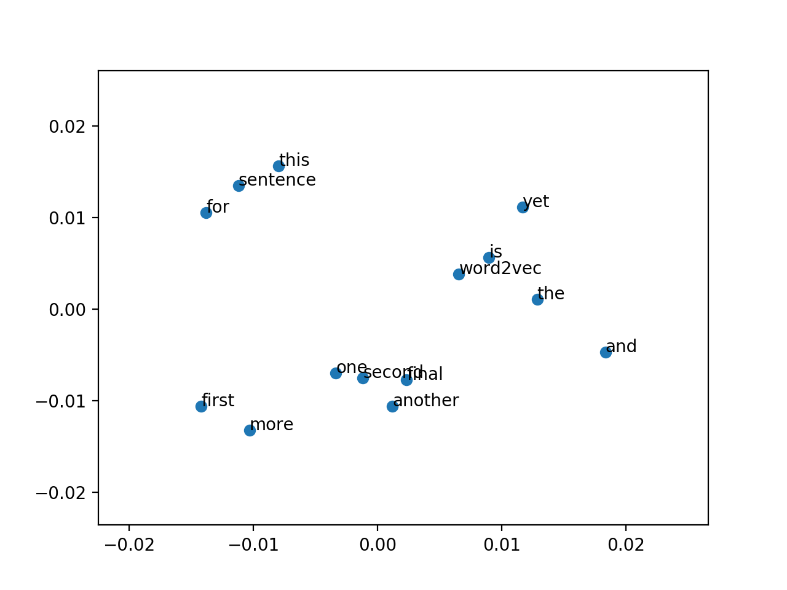

# How to Develop Word Embeddings with Gensim
Word embeddings are a modern approach for representing text in natural language processing.
Embedding algorithms like Word2Vec and GloVe are key to the state-of-the-art results achieved
by neural network models on natural language processing problems like machine translation.
In this tutorial, you will discover how to train and load word embedding models for natural
language processing applications in Python using Gensim. After completing this tutorial, you
will know:
- How to train your own Word2Vec word embedding model on text data.
- How to visualize a trained word embedding model using Principal Component Analysis.
- How to load pre-trained Word2Vec and GloVe word embedding models from Google and
Stanford.

Let's get started.

# Tutorial Overview

This tutorial is divided into the following parts:
1. Word Embeddings
2. Gensim Library
3. Develop Word2Vec Embedding
4. Visualize Word Embedding
5. Load Google's Word2Vec Embedding
6. Load Stanford's GloVe Embedding

Word Embeddings

A word embedding is an approach to provide a dense vector representation of words that capture
something about their meaning. Word embeddings are an improvement over simpler bag-of-word
model word encoding schemes like word counts and frequencies that result in large and sparse
vectors (mostly 0 values) that describe documents but not the meaning of the words.
Word embeddings work by using an algorithm to train a set of fixed-length dense and
continuous-valued vectors based on a large corpus of text. Each word is represented by a
point in the embedding space and these points are learned and moved around based on the
words that surround the target word. It is defining a word by the company that it keeps that
allows the word embedding to learn something about the meaning of words. The vector space
representation of the words provides a projection where words with similar meanings are locally
clustered within the space.
The use of word embeddings over other text representations is one of the key methods that
has led to breakthrough performance with deep neural networks on problems like machine
translation. In this tutorial, we are going to look at how to use two different word embedding
methods called Word2Vec by researchers at Google and GloVe by researchers at Stanford.

12.3

Gensim Python Library

Gensim is an open source Python library for natural language processing, with a focus on topic
modeling. It is billed as “topic modeling for humans”. Gensim was developed and is maintained
by the Czech natural language processing researcher Radim Rehurek and his company RaRe
Technologies. It is not an everything-including-the-kitchen-sink NLP research library (like
NLTK); instead, Gensim is a mature, focused, and efficient suite of NLP tools for topic modeling.
Most notably for this tutorial, it supports an implementation of the Word2Vec word embedding
for learning new word vectors from text.
It also provides tools for loading pre-trained word embeddings in a few formats and for
making use and querying a loaded embedding. We will use the Gensim library in this tutorial.
Gensim can be installed easily using pip or easy install. For example, you can install Gensim
with pip by typing the following on your command line:

```
sudo pip install -U gensim
```

If you need help installing Gensim on your system, you can see the Gensim Installation
Instructions (linked at the end of the chapter).

12.4

Develop Word2Vec Embedding

Word2Vec is one algorithm for learning a word embedding from a text corpus. There are two
main training algorithms that can be used to learn the embedding from text; they are Continuous
Bag-of-Words (CBOW) and skip grams. We will not get into the algorithms other than to say
that they generally look at a window of words for each target word to provide context and in
turn meaning for words. The approach was developed by Tomas Mikolov, formerly at Google
and currently at Facebook.

## Develop Word2Vec Embedding

Word2Vec models require a lot of text, e.g. the entire Wikipedia corpus. Nevertheless, we
will demonstrate the principles using a small in-memory example of text. Gensim provides the
Word2Vec class for working with a Word2Vec model. Learning a word embedding from text
involves loading and organizing the text into sentences and providing them to the constructor
of a new Word2Vec() instance. For example:
sentences = ...

```
model = Word2Vec(sentences)

```

Specifically, each sentence must be tokenized, meaning divided into words and prepared (e.g.
perhaps pre-filtered and perhaps converted to a preferred case). The sentences could be text
loaded into memory, or an iterator that progressively loads text, required for very large text
corpora. There are many parameters on this constructor; a few noteworthy arguments you may
wish to configure are:
- size: (default 100) The number of dimensions of the embedding, e.g. the length of the
dense vector to represent each token (word).
- window: (default 5) The maximum distance between a target word and words around the
target word.
- min count: (default 5) The minimum count of words to consider when training the model;
words with an occurrence less than this count will be ignored.
- workers: (default 3) The number of threads to use while training.
- sg: (default 0 or CBOW) The training algorithm, either CBOW (0) or skip gram (1).

The defaults are often good enough when just getting started. If you have a lot of cores, as
most modern computers do, I strongly encourage you to increase workers to match the number
of cores (e.g. 8). After the model is trained, it is accessible via the wv attribute. This is the
actual word vector model in which queries can be made. For example, you can print the learned
vocabulary of tokens (words) as follows:

```
words = list(model.wv.vocab)
print(words)

```

You can review the embedded vector for a specific token as follows:

```
print(model['word'])

```

Finally, a trained model can then be saved to file by calling the save word2vec format()
function on the word vector model. By default, the model is saved in a binary format to save
space. For example:

```
model.wv.save_word2vec_format('model.bin')

```


#### Develop Word2Vec Embedding

When getting started, you can save the learned model in ASCII format and review the
contents. You can do this by setting binary=False when calling the save word2vec format()
function, for example:

```
model.wv.save_word2vec_format('model.txt', binary=False)
```

The saved model can then be loaded again by calling the Word2Vec.load() function. For
example:

```
model = Word2Vec.load('model.bin')

```

We can tie all of this together with a worked example. Rather than loading a large text
document or corpus from file, we will work with a small, in-memory list of pre-tokenized
sentences. The model is trained and the minimum count for words is set to 1 so that no words
are ignored. After the model is learned, we summarize, print the vocabulary, then print a single
vector for the word “sentence”. Finally, the model is saved to a file in binary format, loaded,
and then summarized.

```
from gensim.models import Word2Vec
# define training data
sentences = [['this', 'is', 'the', 'first', 'sentence', 'for', 'word2vec'],
['this', 'is', 'the', 'second', 'sentence'],
['yet', 'another', 'sentence'],
['one', 'more', 'sentence'],
['and', 'the', 'final', 'sentence']]
# train model
model = Word2Vec(sentences, min_count=1)
# summarize the loaded model
print(model)
# summarize vocabulary
words = list(model.wv.vocab)
print(words)
# access vector for one word
print(model['sentence'])
# save model
model.save('model.bin')
# load model
new_model = Word2Vec.load('model.bin')
print(new_model)

```

Running the example prints the following output.
Note: Given the stochastic nature of neural networks, your specific results may vary. Consider
running the example a few times.

```
Word2Vec(vocab=14, size=100, alpha=0.025)
['second', 'sentence', 'and', 'this', 'final', 'word2vec', 'for', 'another', 'one',
'first', 'more', 'the', 'yet', 'is']
[ -4.61881841e-03 -4.88735968e-03 -3.19508743e-03 4.08568839e-03
-3.38211656e-03 1.93076557e-03 3.90265253e-03 -1.04349572e-03
4.14286414e-03 1.55219622e-03 3.85653134e-03 2.22428422e-03
-3.52565176e-03 2.82056746e-03 -2.11121864e-03 -1.38054823e-03
-1.12888147e-03 -2.87318649e-03 -7.99703528e-04 3.67874932e-03
2.68940022e-03 6.31021452e-04 -4.36326629e-03 2.38655557e-04
-1.94210222e-03 4.87691024e-03 -4.04118607e-03 -3.17813386e-03
4.94802603e-03 3.43150692e-03 -1.44031656e-03 4.25637932e-03
-1.15106850e-04 -3.73274647e-03 2.50349124e-03 4.28692997e-03
-3.57313151e-03 -7.24728088e-05 -3.46099050e-03 -3.39612062e-03
3.54845310e-03 1.56780297e-03 4.58260969e-04 2.52689526e-04
3.06256465e-03 2.37558200e-03 4.06933809e-03 2.94650183e-03
-2.96231941e-03 -4.47433954e-03 2.89590308e-03 -2.16034567e-03
-2.58548348e-03 -2.06163677e-04 1.72605237e-03 -2.27384618e-04
-3.70194600e-03 2.11557443e-03 2.03793868e-03 3.09839356e-03
-4.71800892e-03 2.32995977e-03 -6.70911541e-05 1.39375112e-03
-3.84263694e-03 -1.03898917e-03 4.13251948e-03 1.06330717e-03
1.38514000e-03 -1.18144893e-03 -2.60811858e-03 1.54952740e-03
2.49916781e-03 -1.95435272e-03 8.86975031e-05 1.89820060e-03
-3.41996481e-03 -4.08187555e-03 5.88635216e-04 4.13103355e-03
-3.25899688e-03 1.02130906e-03 -3.61028523e-03 4.17646067e-03
4.65870230e-03 3.64110398e-04 4.95479070e-03 -1.29743712e-03
-5.03367570e-04 -2.52546836e-03 3.31060472e-03 -3.12870182e-03
-1.14580349e-03 -4.34387522e-03 -4.62882593e-03 3.19007039e-03
2.88707414e-03 1.62976081e-04 -6.05802808e-04 -1.06368808e-03]
Word2Vec(vocab=14, size=100, alpha=0.025)

```

You can see that with a little work to prepare your text document, you can create your own
word embedding very easily with Gensim.

12.5

Visualize Word Embedding

After you learn word embedding for your text data, it can be nice to explore it with visualization.
You can use classical projection methods to reduce the high-dimensional word vectors to twodimensional plots and plot them on a graph. The visualizations can provide a qualitative
diagnostic for your learned model. We can retrieve all of the vectors from a trained model as
follows:

```
X = model[model.wv.vocab]
```

We can then train a projection method on the vectors, such as those methods offered in
scikit-learn, then use Matplotlib to plot the projection as a scatter plot. Let's look at an example
with Principal Component Analysis or PCA.

### Plot Word Vectors Using PCA

We can create a 2-dimensional PCA model of the word vectors using the scikit-learn PCA class
as follows.

```
pca = PCA(n_components=2)
result = pca.fit_transform(X)
```

The resulting projection can be plotted using Matplotlib as follows, pulling out the two
dimensions as x and y coordinates.

```
pyplot.scatter(result[:, 0], result[:, 1])

```

We can go one step further and annotate the points on the graph with the words themselves.
A crude version without any nice offsets looks as follows.

```
words = list(model.wv.vocab)
for i, word in enumerate(words):
pyplot.annotate(word, xy=(result[i, 0], result[i, 1]))

```

Putting this all together with the model from the previous section, the complete example is
listed below.

```
from gensim.models import Word2Vec
from sklearn.decomposition import PCA
from matplotlib import pyplot
# define training data
sentences = [['this', 'is', 'the', 'first', 'sentence', 'for', 'word2vec'],
['this', 'is', 'the', 'second', 'sentence'],
['yet', 'another', 'sentence'],
['one', 'more', 'sentence'],
['and', 'the', 'final', 'sentence']]
# train model
model = Word2Vec(sentences, min_count=1)
# fit a 2d PCA model to the vectors
X = model[model.wv.vocab]
pca = PCA(n_components=2)
result = pca.fit_transform(X)
# create a scatter plot of the projection
pyplot.scatter(result[:, 0], result[:, 1])
words = list(model.wv.vocab)
for i, word in enumerate(words):
pyplot.annotate(word, xy=(result[i, 0], result[i, 1]))
pyplot.show()

```

Running the example creates a scatter plot with the dots annotated with the words. It is
hard to pull much meaning out of the graph given such a tiny corpus was used to fit the model.
Note: Given the stochastic nature of neural networks, your specific results may vary. Consider
running the example a few times.



12.6

Load Google's Word2Vec Embedding

Training your own word vectors may be the best approach for a given NLP problem. But it
can take a long time, a fast computer with a lot of RAM and disk space, and perhaps some
expertise in finessing the input data and training algorithm. An alternative is to simply use an
existing pre-trained word embedding. Along with the paper and code for Word2Vec, Google
also published a pre-trained Word2Vec model on the Word2Vec Google Code Project.
A pre-trained model is nothing more than a file containing tokens and their associated word
vectors. The pre-trained Google Word2Vec model was trained on Google news data (about 100
billion words); it contains 3 million words and phrases and was fit using 300-dimensional word
vectors. It is a 1.53 Gigabyte file. You can download it from here:
- GoogleNews-vectors-negative300.bin.gz: https://drive.google.com/file/d/0B7XkCwpI5KDYNlNUTTlSS21pQmM/edit?usp=sharing


#### Download Dataset
Dataset is very huge. Before running the notebook, download the dataset and unzip it.

```
filename="GoogleNews-vectors-negative300.bin.gz"
fileid="0B7XkCwpI5KDYNlNUTTlSS21pQmM"
curl -c ./cookie -s -L "https://drive.google.com/uc?export=download&id=${fileid}" > /dev/null
curl -Lb ./cookie "https://drive.google.com/uc?export=download&confirm=`awk '/download/ {print $NF}' ./cookie`&id=${fileid}" -o ${filename}
```

`gunzip GoogleNews-vectors-negative300.bin.gz`

Unzipped, the binary file (GoogleNews-vectors-negative300.bin) is 3.4 Gigabytes. The
Gensim library provides tools to load this file. Specifically, you can call the
KeyedVectors.load word2vec format() function to load this model into memory, for example:
from gensim.models import KeyedVectors

# Load Stanford's GloVe Embedding

```
filename = 'GoogleNews-vectors-negative300.bin'
model = KeyedVectors.load_word2vec_format(filename, binary=True)

```

Note, this example may require a workstation with 8 or more Gigabytes of RAM to execute.
On my modern workstation, it takes about 43 seconds to load. Another interesting thing that
you can do is do a little linear algebra arithmetic with words. For example, a popular example
described in lectures and introduction papers is:

```
queen = (king - man) + woman
```

That is the word queen is the closest word given the subtraction of the notion of man from
king and adding the word woman. The man-ness in king is replaced with woman-ness to give
us queen. A very cool concept. Gensim provides an interface for performing these types of
operations in the most similar() function on the trained or loaded model. For example:
result = model.most_similar(positive=['woman', 'king'], negative=['man'], topn=1)

```
print(result)
```

We can put all of this together as follows.

```
from gensim.models import KeyedVectors
# load the google word2vec model
filename = 'GoogleNews-vectors-negative300.bin'
model = KeyedVectors.load_word2vec_format(filename, binary=True)
# calculate: (king - man) + woman = ?
result = model.most_similar(positive=['woman', 'king'], negative=['man'], topn=1)
print(result)
```

Running the example loads the Google pre-trained Word2Vec model and then calculates the
(king - man) + woman = ? operation on the word vectors for those words. The answer, as we
would expect, is queen.

```
[('queen', 0.7118192315101624)]
```

See some of the articles in the further reading section for more interesting arithmetic examples
that you can explore.

# Load Stanford's GloVe Embedding

Stanford researchers also have their own word embedding algorithm like Word2Vec called Global
Vectors for Word Representation, or GloVe for short. I won't get into the details of the differences
between Word2Vec and GloVe here, but generally, NLP practitioners seem to prefer GloVe at
the moment based on results.
Like Word2Vec, the GloVe researchers also provide pre-trained word vectors, in this case, a
great selection to choose from. You can download the GloVe pre-trained word vectors and load
them easily with Gensim. The first step is to convert the GloVe file format to the Word2Vec file
format. The only difference is the addition of a small header line. This can be done by calling
the glove2word2vec() function. For example (note, this example is just a demonstration with
a mock input filename):

```
from gensim.scripts.glove2word2vec import glove2word2vec
glove_input_file = 'glove.txt'
word2vec_output_file = 'word2vec.txt'
glove2word2vec(glove_input_file, word2vec_output_file)
```

Once converted, the file can be loaded just like Word2Vec file above. Let's make this concrete
with an example. You can download the smallest GloVe pre-trained model from the GloVe
website. It an 822 Megabyte zip file with 4 different models (50, 100, 200 and 300-dimensional
vectors) trained on Wikipedia data with 6 billion tokens and a 400,000 word vocabulary. The
direct download link is here:
- glove.6B.zip: http://nlp.stanford.edu/data/glove.6B.zip

#### Download Dataset
Dataset is very huge. Before running the notebook, download the dataset and unzip it.

`curl -L  http://downloads.cs.stanford.edu/nlp/data/glove.6B.zip -o glove.6B.zip`

`unzip glove.6B.zip`

Working with the 100-dimensional version of the model, we can convert the file to Word2Vec
format as follows:

```
from gensim.scripts.glove2word2vec import glove2word2vec
glove_input_file = 'glove.6B.100d.txt'
word2vec_output_file = 'glove.6B.100d.txt.word2vec'
glove2word2vec(glove_input_file, word2vec_output_file)

```

You now have a copy of the GloVe model in Word2Vec format with the filename
glove.6B.100d.txt.word2vec. Now we can load it and perform the same (king - man) +
woman = ? test as in the previous section. The complete code listing is provided below. Note
that the converted file is ASCII format, not binary, so we set binary=False when loading.

```
from gensim.models import KeyedVectors
# load the Stanford GloVe model
filename = 'glove.6B.100d.txt.word2vec'
model = KeyedVectors.load_word2vec_format(filename, binary=False)
# calculate: (king - man) + woman = ?
result = model.most_similar(positive=['woman', 'king'], negative=['man'], topn=1)
print(result)
```

Pulling all of this together, the complete example is listed below.

```
from gensim.models import KeyedVectors
from gensim.scripts.glove2word2vec import glove2word2vec
# convert glove to word2vec format
glove_input_file = 'glove.6B.100d.txt'
word2vec_output_file = 'glove.6B.100d.txt.word2vec'
glove2word2vec(glove_input_file, word2vec_output_file)
# load the converted model
filename = 'glove.6B.100d.txt.word2vec'
model = KeyedVectors.load_word2vec_format(filename, binary=False)
# calculate: (king - man) + woman = ?
result = model.most_similar(positive=['woman', 'king'], negative=['man'], topn=1)
print(result)

```

Running the example prints the same result of queen.
[('queen', 0.7698540687561035)]

```


##### Run Notebook
Click notebook `1_example_word2vec.ipynb` in jupterLab UI and run jupyter notebook.

##### Run Notebook
Click notebook `2_plot_model.ipynb` in jupterLab UI and run jupyter notebook.

##### Run Notebook
Click notebook `3_word_vector_arithmetic.ipynb` in jupterLab UI and run jupyter notebook.

##### Run Notebook
Click notebook `4_example_glove.ipynb` in jupterLab UI and run jupyter notebook.


# Further Reading

This section provides more resources on the topic if you are looking go deeper.

Word Embeddings

- Word Embedding on Wikipedia.
https://en.wikipedia.org/wiki/Word2vec
- Word2Vec on Wikipedia.
https://en.wikipedia.org/wiki/Word2vec
- Google Word2Vec project.
https://code.google.com/archive/p/word2vec/
- Stanford GloVe project.
https://nlp.stanford.edu/projects/glove/

Gensim

- Gensim Python Library.
https://radimrehurek.com/gensim/index.html
- Gensim Installation Instructions.
https://radimrehurek.com/gensim/install.html
- models.word2vec Gensim API.
https://radimrehurek.com/gensim/models/keyedvectors.html
- models.keyedvectors Gensim API.
https://radimrehurek.com/gensim/models/keyedvectors.html
- scripts.glove2word2vec Gensim API.
https://radimrehurek.com/gensim/scripts/glove2word2vec.html

Articles

- Messing Around With Word2Vec, 2016.
https://quomodocumque.wordpress.com/2016/01/15/messing-around-with-word2vec/
- Vector Space Models for the Digital Humanities, 2015.
http://bookworm.benschmidt.org/posts/2015-10-25-Word-Embeddings.html
- Gensim Word2Vec Tutorial, 2014.
https://rare-technologies.com/word2vec-tutorial/

# Summary

In this tutorial, you discovered how to develop and load word embedding layers in Python using
Gensim. Specifically, you learned:
- How to train your own Word2Vec word embedding model on text data.
- How to visualize a trained word embedding model using Principal Component Analysis.
- How to load pre-trained Word2Vec and GloVe word embedding models from Google and
Stanford.
