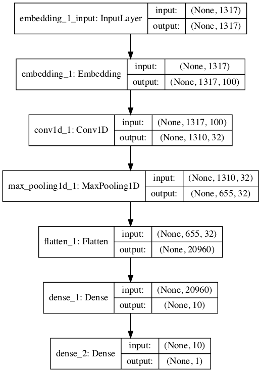

# Project: Develop an Embedding + CNN Model for Sentiment Analysis
Word embeddings are a technique for representing text where different words with similar
meaning have a similar real-valued vector representation. They are a key breakthrough that has
led to great performance of neural network models on a suite of challenging natural language
processing problems. In this tutorial, you will discover how to develop word embedding models
with convolutional neural networks to classify movie reviews. After completing this tutorial,
you will know:
- How to prepare movie review text data for classification with deep learning methods.
- How to develop a neural classification model with word embedding and convolutional
layers.
- How to evaluate the developed a neural classification model.

Let's get started.

# Tutorial Overview

This tutorial is divided into the following parts:
1. Movie Review Dataset
2. Data Preparation
3. Train CNN With Embedding Layer
4. Evaluate Model

# Movie Review Dataset

In this tutorial, we will use the Movie Review Dataset. This dataset designed for sentiment
analysis was described previously. You can download the dataset from here:

- Movie Review Polarity Dataset (review polarity.tar.gz, 3MB).
http://www.cs.cornell.edu/people/pabo/movie-review-data/review_polarity.tar.
gz

Dataset has been **downloaded already** , you will have a directory called txt sentoken with two subdirectories containing the text neg and pos for negative and positive reviews. Reviews are stored
one per file with a naming convention cv000 to cv999 for each of neg and pos.

# Data Preparation

**Note:** The preparation of the movie review dataset was first described previously. In this
section, we will look at 3 things:
1. Separation of data into training and test sets.
2. Loading and cleaning the data to remove punctuation and numbers.
3. Defining a vocabulary of preferred words.

Split into Train and Test Sets

We are pretending that we are developing a system that can predict the sentiment of a textual
movie review as either positive or negative. This means that after the model is developed, we
will need to make predictions on new textual reviews. This will require all of the same data
preparation to be performed on those new reviews as is performed on the training data for the
model. We will ensure that this constraint is built into the evaluation of our models by splitting
the training and test datasets prior to any data preparation. This means that any knowledge in
the data in the test set that could help us better prepare the data (e.g. the words used) are
unavailable in the preparation of data used for training the model.
That being said, we will use the last 100 positive reviews and the last 100 negative reviews
as a test set (100 reviews) and the remaining 1,800 reviews as the training dataset. This is a
90% train, 10% split of the data. The split can be imposed easily by using the filenames of the
reviews where reviews named 000 to 899 are for training data and reviews named 900 onwards
are for test.

Loading and Cleaning Reviews

The text data is already pretty clean; not much preparation is required. Without getting bogged
down too much in the details, we will prepare the data using the following way:
- Split tokens on white space.
- Remove all punctuation from words.
- Remove all words that are not purely comprised of alphabetical characters.
- Remove all words that are known stop words.
- Remove all words that have a length ≤ 1 character.

Data Preparation

We can put all of these steps into a function called clean doc() that takes as an argument
the raw text loaded from a file and returns a list of cleaned tokens. We can also define a function
load doc() that loads a document from file ready for use with the clean doc() function. An
example of cleaning the first positive review is listed below.

```
from nltk.corpus import stopwords
import string
import re
# load doc into memory
def load_doc(filename):
# open the file as read only
file = open(filename, 'r')
# read all text
text = file.read()
# close the file
file.close()
return text
# turn a doc into clean tokens
def clean_doc(doc):
# split into tokens by white space
tokens = doc.split()
# prepare regex for char filtering
re_punc = re.compile('[%s]' % re.escape(string.punctuation))
# remove punctuation from each word
tokens = [re_punc.sub('', w) for w in tokens]
# remove remaining tokens that are not alphabetic
tokens = [word for word in tokens if word.isalpha()]
# filter out stop words
stop_words = set(stopwords.words('english'))
tokens = [w for w in tokens if not w in stop_words]
# filter out short tokens
tokens = [word for word in tokens if len(word) > 1]
return tokens
# load the document
filename = 'txt_sentoken/pos/cv000_29590.txt'
text = load_doc(filename)
tokens = clean_doc(text)
print(tokens)

```

Running the example prints a long list of clean tokens. There are many more cleaning steps
we may want to explore and I leave them as further exercises.

```
...
'creepy', 'place', 'even', 'acting', 'hell', 'solid', 'dreamy', 'depp', 'turning',
'typically', 'strong', 'performance', 'deftly', 'handling', 'british', 'accent',
'ians', 'holm', 'joe', 'goulds', 'secret', 'richardson', 'dalmatians', 'log', 'great',
'supporting', 'roles', 'big', 'surprise', 'graham', 'cringed', 'first', 'time',
'opened', 'mouth', 'imagining', 'attempt', 'irish', 'accent', 'actually', 'wasnt',
'half', 'bad', 'film', 'however', 'good', 'strong', 'violencegore', 'sexuality',
'language', 'drug', 'content']

```
# Define a Vocabulary

It is important to define a vocabulary of known words when using a text model. The more
words, the larger the representation of documents, therefore it is important to constrain the
words to only those believed to be predictive. This is difficult to know beforehand and often it
is important to test different hypotheses about how to construct a useful vocabulary. We have
already seen how we can remove punctuation and numbers from the vocabulary in the previous
section. We can repeat this for all documents and build a set of all known words.
We can develop a vocabulary as a Counter, which is a dictionary mapping of words and
their count that allows us to easily update and query. Each document can be added to the
counter (a new function called add doc to vocab()) and we can step over all of the reviews in
the negative directory and then the positive directory (a new function called process docs()).
The complete example is listed below.

```
import string
import re
from os import listdir
from collections import Counter
from nltk.corpus import stopwords
# load doc into memory
def load_doc(filename):
# open the file as read only
file = open(filename, 'r')
# read all text
text = file.read()
# close the file
file.close()
return text
# turn a doc into clean tokens
def clean_doc(doc):
# split into tokens by white space
tokens = doc.split()
# prepare regex for char filtering
re_punc = re.compile('[%s]' % re.escape(string.punctuation))
# remove punctuation from each word
tokens = [re_punc.sub('', w) for w in tokens]
# remove remaining tokens that are not alphabetic
tokens = [word for word in tokens if word.isalpha()]
# filter out stop words
stop_words = set(stopwords.words('english'))
tokens = [w for w in tokens if not w in stop_words]
# filter out short tokens
tokens = [word for word in tokens if len(word) > 1]
return tokens
# load doc and add to vocab
def add_doc_to_vocab(filename, vocab):
# load doc
doc = load_doc(filename)
# clean doc
tokens = clean_doc(doc)
# update counts
vocab.update(tokens)
# load all docs in a directory
def process_docs(directory, vocab):
# walk through all files in the folder
for filename in listdir(directory):
# skip any reviews in the test set
if filename.startswith('cv9'):
continue
# create the full path of the file to open
path = directory + '/' + filename
# add doc to vocab
add_doc_to_vocab(path, vocab)
# define vocab
vocab = Counter()
# add all docs to vocab
process_docs('txt_sentoken/pos', vocab)
process_docs('txt_sentoken/neg', vocab)
# print the size of the vocab
print(len(vocab))
# print the top words in the vocab
print(vocab.most_common(50))

```

Running the example shows that we have a vocabulary of 44,276 words. We also can see
a sample of the top 50 most used words in the movie reviews. Note that this vocabulary was
constructed based on only those reviews in the training dataset.

```
44276
[('film', 7983), ('one', 4946), ('movie', 4826), ('like', 3201), ('even', 2262), ('good',
2080), ('time', 2041), ('story', 1907), ('films', 1873), ('would', 1844), ('much',
1824), ('also', 1757), ('characters', 1735), ('get', 1724), ('character', 1703),
('two', 1643), ('first', 1588), ('see', 1557), ('way', 1515), ('well', 1511), ('make',
1418), ('really', 1407), ('little', 1351), ('life', 1334), ('plot', 1288), ('people',
1269), ('could', 1248), ('bad', 1248), ('scene', 1241), ('movies', 1238), ('never',
1201), ('best', 1179), ('new', 1140), ('scenes', 1135), ('man', 1131), ('many', 1130),
('doesnt', 1118), ('know', 1092), ('dont', 1086), ('hes', 1024), ('great', 1014),
('another', 992), ('action', 985), ('love', 977), ('us', 967), ('go', 952),
('director', 948), ('end', 946), ('something', 945), ('still', 936)]

```

We can step through the vocabulary and remove all words that have a low occurrence, such
as only being used once or twice in all reviews. For example, the following snippet will retrieve
only the tokens that appear 2 or more times in all reviews.

```
# keep tokens with a min occurrence
min_occurrence = 2
tokens = [k for k,c in vocab.items() if c >= min_occurrence]
print(len(tokens))

```

Finally, the vocabulary can be saved to a new file called vocab.txt that we can later load
and use to filter movie reviews prior to encoding them for modeling. We define a new function
called save list() that saves the vocabulary to file, with one word per line. For example:

```
# save list to file
def save_list(lines, filename):
# convert lines to a single blob of text
data = '\n'.join(lines)
# open file
file = open(filename, 'w')
# write text
file.write(data)
# close file
file.close()
# save tokens to a vocabulary file
save_list(tokens, 'vocab.txt')

```

Pulling all of this together, the complete example is listed below.

```
import string
import re
from os import listdir
from collections import Counter
from nltk.corpus import stopwords
# load doc into memory
def load_doc(filename):
# open the file as read only
file = open(filename, 'r')
# read all text
text = file.read()
# close the file
file.close()
return text
# turn a doc into clean tokens
def clean_doc(doc):
# split into tokens by white space
tokens = doc.split()
# prepare regex for char filtering
re_punc = re.compile('[%s]' % re.escape(string.punctuation))
# remove punctuation from each word
tokens = [re_punc.sub('', w) for w in tokens]
# remove remaining tokens that are not alphabetic
tokens = [word for word in tokens if word.isalpha()]
# filter out stop words
stop_words = set(stopwords.words('english'))
tokens = [w for w in tokens if not w in stop_words]
# filter out short tokens
tokens = [word for word in tokens if len(word) > 1]
return tokens
# load doc and add to vocab
def add_doc_to_vocab(filename, vocab):
# load doc
doc = load_doc(filename)
# clean doc
tokens = clean_doc(doc)
# update counts
vocab.update(tokens)
# load all docs in a directory
def process_docs(directory, vocab):
# walk through all files in the folder
for filename in listdir(directory):
# skip any reviews in the test set
if filename.startswith('cv9'):
continue
# create the full path of the file to open
path = directory + '/' + filename
# add doc to vocab
add_doc_to_vocab(path, vocab)
# save list to file
def save_list(lines, filename):
# convert lines to a single blob of text
data = '\n'.join(lines)
# open file
file = open(filename, 'w')
# write text
file.write(data)
# close file
file.close()
# define vocab
vocab = Counter()
# add all docs to vocab
process_docs('txt_sentoken/pos', vocab)
process_docs('txt_sentoken/neg', vocab)
# print the size of the vocab
print(len(vocab))
# keep tokens with a min occurrence
min_occurrence = 2
tokens = [k for k,c in vocab.items() if c >= min_occurrence]
print(len(tokens))
# save tokens to a vocabulary file
save_list(tokens, 'vocab.txt')

```

Running the above example with this addition shows that the vocabulary size drops by a
little more than half its size, from 44,276 to 25,767 words.

```
25767

```

Running the min occurrence filter on the vocabulary and saving it to file, you should now
have a new file called vocab.txt with only the words we are interested in. The order of words
in your file will differ, but should look something like the following:

```
aberdeen
dupe
burt
libido
hamlet
arlene
available
corners
web
columbia
...

```

We are now ready to look at extracting features from the reviews ready for modeling.

Train CNN With Embedding Layer

In this section, we will learn a word embedding while training a convolutional neural network on
the classification problem. A word embedding is a way of representing text where each word in
the vocabulary is represented by a real valued vector in a high-dimensional space. The vectors
are learned in such a way that words that have similar meanings will have similar representation
in the vector space (close in the vector space). This is a more expressive representation for text
than more classical methods like bag-of-words, where relationships between words or tokens are
ignored, or forced in bigram and trigram approaches.
The real valued vector representation for words can be learned while training the neural
network. We can do this in the Keras deep learning library using the Embedding layer. The
first step is to load the vocabulary. We will use it to filter out words from movie reviews that
we are not interested in. If you have worked through the previous section, you should have a
local file called vocab.txt with one word per line. We can load that file and build a vocabulary
as a set for checking the validity of tokens.

```
# load doc into memory
def load_doc(filename):
# open the file as read only
file = open(filename, 'r')
# read all text
text = file.read()
# close the file
file.close()
return text
# load the vocabulary
vocab_filename = 'vocab.txt'
vocab = load_doc(vocab_filename)
vocab = set(vocab.split())

```

Next, we need to load all of the training data movie reviews. For that we can adapt the
process docs() from the previous section to load the documents, clean them, and return them
as a list of strings, with one document per string. We want each document to be a string for
easy encoding as a sequence of integers later. Cleaning the document involves splitting each
review based on white space, removing punctuation, and then filtering out all tokens not in the
vocabulary. The updated clean doc() function is listed below.

```
# turn a doc into clean tokens
def clean_doc(doc, vocab):
# split into tokens by white space
tokens = doc.split()
# prepare regex for char filtering
re_punc = re.compile('[%s]' % re.escape(string.punctuation))
# remove punctuation from each word
tokens = [re_punc.sub('', w) for w in tokens]
# filter out tokens not in vocab
tokens = [w for w in tokens if w in vocab]
tokens = ' '.join(tokens)
return tokens

```

The updated process docs() can then call the clean doc() for each document in a given
directory.

```
def process_docs(directory, vocab, is_train):
documents = list()
# walk through all files in the folder
for filename in listdir(directory):
# skip any reviews in the test set
if is_train and filename.startswith('cv9'):
continue
if not is_train and not filename.startswith('cv9'):
continue
# create the full path of the file to open
path = directory + '/' + filename
# load the doc
doc = load_doc(path)
# clean doc
tokens = clean_doc(doc, vocab)
# add to list
documents.append(tokens)
return documents
```

We can call the process docs function for both the neg and pos directories and combine
the reviews into a single train or test dataset. We also can define the class labels for the dataset.
The load clean dataset() function below will load all reviews and prepare class labels for the
training or test dataset.

```
def load_clean_dataset(vocab, is_train):
# load documents
neg = process_docs('txt_sentoken/neg', vocab, is_train)
pos = process_docs('txt_sentoken/pos', vocab, is_train)
docs = neg + pos
# prepare labels
labels = array([0 for _ in range(len(neg))] + [1 for _ in range(len(pos))])
return docs, labels
```

The next step is to encode each document as a sequence of integers. The Keras Embedding
layer requires integer inputs where each integer maps to a single token that has a specific
real-valued vector representation within the embedding. These vectors are random at the
beginning of training, but during training become meaningful to the network. We can encode
the training documents as sequences of integers using the Tokenizer class in the Keras API.
First, we must construct an instance of the class then train it on all documents in the training
dataset. In this case, it develops a vocabulary of all tokens in the training dataset and develops
a consistent mapping from words in the vocabulary to unique integers. We could just as easily
develop this mapping ourselves using our vocabulary file. The create tokenizer() function
below will prepare a Tokenizer from the training data.

```
# fit a tokenizer
def create_tokenizer(lines):
tokenizer = Tokenizer()
tokenizer.fit_on_texts(lines)
return tokenizer

```

Now that the mapping of words to integers has been prepared, we can use it to encode the
reviews in the training dataset. We can do that by calling the texts to sequences() function
on the Tokenizer. We also need to ensure that all documents have the same length. This is a
requirement of Keras for efficient computation. We could truncate reviews to the smallest size
or zero-pad (pad with the value 0) reviews to the maximum length, or some hybrid. In this case,
we will pad all reviews to the length of the longest review in the training dataset. First, we can
find the longest review using the max() function on the training dataset and take its length.
We can then call the Keras function pad sequences() to pad the sequences to the maximum
length by adding 0 values on the end.

```

max_length = max([len(s.split()) for s in train_docs])
print('Maximum length: %d' % max_length)

```

We can then use the maximum length as a parameter to a function to integer encode and
pad the sequences.

```
# integer encode and pad documents
def encode_docs(tokenizer, max_length, docs):
# integer encode
encoded = tokenizer.texts_to_sequences(docs)
# pad sequences
padded = pad_sequences(encoded, maxlen=max_length, padding='post')
return padded

```

We are now ready to define our neural network model. The model will use an Embedding
layer as the first hidden layer. The Embedding layer requires the specification of the vocabulary
size, the size of the real-valued vector space, and the maximum length of input documents. The
vocabulary size is the total number of words in our vocabulary, plus one for unknown words.
This could be the vocab set length or the size of the vocab within the tokenizer used to integer
encode the documents, for example:

```
# define vocabulary size
vocab_size = len(tokenizer.word_index) + 1
print('Vocabulary size: %d' % vocab_size)

```

We will use a 100-dimensional vector space, but you could try other values, such as 50 or
150. Finally, the maximum document length was calculated above in the max length variable
used during padding. The complete model definition is listed below including the Embedding
layer. We use a Convolutional Neural Network (CNN) as they have proven to be successful
at document classification problems. A conservative CNN configuration is used with 32 filters
(parallel fields for processing words) and a kernel size of 8 with a rectified linear (relu) activation
function. This is followed by a pooling layer that reduces the output of the convolutional layer
by half.

Next, the 2D output from the CNN part of the model is flattened to one long 2D vector to
represent the features extracted by the CNN. The back-end of the model is a standard Multilayer
Perceptron layers to interpret the CNN features. The output layer uses a sigmoid activation
function to output a value between 0 and 1 for the negative and positive sentiment in the review.

```
# define the model
def define_model(vocab_size, max_length):
model = Sequential()
model.add(Embedding(vocab_size, 100, input_length=max_length))
model.add(Conv1D(filters=32, kernel_size=8, activation='relu'))
model.add(MaxPooling1D(pool_size=2))
model.add(Flatten())
model.add(Dense(10, activation='relu'))
model.add(Dense(1, activation='sigmoid'))
# compile network
model.compile(loss='binary_crossentropy', optimizer='adam', metrics=['accuracy'])
# summarize defined model
model.summary()
plot_model(model, to_file='model.png', show_shapes=True)
return model

```

Running just this piece provides a summary of the defined network. We can see that the
Embedding layer expects documents with a length of 1,317 words as input and encodes each
word in the document as a 100 element vector.

```
_________________________________________________________________
Layer (type)
Output Shape
Param #
=================================================================
embedding_1 (Embedding)
(None, 1317, 100)
2576800
_________________________________________________________________
conv1d_1 (Conv1D)
(None, 1310, 32)
25632
_________________________________________________________________
max_pooling1d_1 (MaxPooling1 (None, 655, 32)
0
_________________________________________________________________
flatten_1 (Flatten)
(None, 20960)
0
_________________________________________________________________
dense_1 (Dense)
(None, 10)
209610
_________________________________________________________________

dense_2 (Dense)
(None, 1)
11
=================================================================
Total params: 2,812,053
Trainable params: 2,812,053
Non-trainable params: 0
_________________________________________________________________

```

A plot the defined model is then saved to file with the name model.png.



Next, we fit the network on the training data. We use a binary cross entropy loss function
because the problem we are learning is a binary classification problem. The efficient Adam
implementation of stochastic gradient descent is used and we keep track of accuracy in addition
to loss during training. The model is trained for 10 epochs, or 10 passes through the training
data. The network configuration and training schedule were found with a little trial and error,
but are by no means optimal for this problem. If you can get better results with a different
configuration, let me know.

```
# fit network
model.fit(Xtrain, ytrain, epochs=10, verbose=2)

```

After the model is fit, it is saved to a file named model.h5 for later evaluation.

```
# save the model
model.save('model.h5')

```

We can tie all of this together. The complete code listing is provided below.

```
import string
import re
from os import listdir
from numpy import array
from keras.preprocessing.text import Tokenizer
from keras.preprocessing.sequence import pad_sequences
from keras.utils.vis_utils import plot_model
from keras.models import Sequential
from keras.layers import Dense
from keras.layers import Flatten
from keras.layers import Embedding
from keras.layers.convolutional import Conv1D
from keras.layers.convolutional import MaxPooling1D
# load doc into memory
def load_doc(filename):
# open the file as read only
file = open(filename, 'r')
# read all text
text = file.read()
# close the file
file.close()
return text
# turn a doc into clean tokens
def clean_doc(doc, vocab):
# split into tokens by white space
tokens = doc.split()
# prepare regex for char filtering
re_punc = re.compile('[%s]' % re.escape(string.punctuation))
# remove punctuation from each word
tokens = [re_punc.sub('', w) for w in tokens]
# filter out tokens not in vocab
tokens = [w for w in tokens if w in vocab]
tokens = ' '.join(tokens)
return tokens
# load all docs in a directory
def process_docs(directory, vocab, is_train):
documents = list()
# walk through all files in the folder
for filename in listdir(directory):
# skip any reviews in the test set
if is_train and filename.startswith('cv9'):
continue
if not is_train and not filename.startswith('cv9'):
continue
# create the full path of the file to open
path = directory + '/' + filename
# load the doc
doc = load_doc(path)
# clean doc
tokens = clean_doc(doc, vocab)
# add to list
documents.append(tokens)
return documents
# load and clean a dataset
def load_clean_dataset(vocab, is_train):
# load documents
neg = process_docs('txt_sentoken/neg', vocab, is_train)
pos = process_docs('txt_sentoken/pos', vocab, is_train)
docs = neg + pos
# prepare labels
labels = array([0 for _ in range(len(neg))] + [1 for _ in range(len(pos))])
return docs, labels
# fit a tokenizer
def create_tokenizer(lines):
tokenizer = Tokenizer()
tokenizer.fit_on_texts(lines)
return tokenizer
# integer encode and pad documents
def encode_docs(tokenizer, max_length, docs):
# integer encode
encoded = tokenizer.texts_to_sequences(docs)
# pad sequences
padded = pad_sequences(encoded, maxlen=max_length, padding='post')
return padded
# define the model
def define_model(vocab_size, max_length):
model = Sequential()
model.add(Embedding(vocab_size, 100, input_length=max_length))
model.add(Conv1D(filters=32, kernel_size=8, activation='relu'))
model.add(MaxPooling1D(pool_size=2))
model.add(Flatten())
model.add(Dense(10, activation='relu'))
model.add(Dense(1, activation='sigmoid'))
# compile network
model.compile(loss='binary_crossentropy', optimizer='adam', metrics=['accuracy'])
# summarize defined model
model.summary()
plot_model(model, to_file='model.png', show_shapes=True)
return model
# load the vocabulary
vocab_filename = 'vocab.txt'
vocab = load_doc(vocab_filename)
vocab = set(vocab.split())
# load training data
train_docs, ytrain = load_clean_dataset(vocab, True)
# create the tokenizer
tokenizer = create_tokenizer(train_docs)
# define vocabulary size
vocab_size = len(tokenizer.word_index) + 1
print('Vocabulary size: %d' % vocab_size)
# calculate the maximum sequence length
max_length = max([len(s.split()) for s in train_docs])
print('Maximum length: %d' % max_length)
# encode data
Xtrain = encode_docs(tokenizer, max_length, train_docs)
# define model
model = define_model(vocab_size, max_length)
# fit network
model.fit(Xtrain, ytrain, epochs=10, verbose=2)
# save the model
model.save('model.h5')

```

Running the example will first provide a summary of the training dataset vocabulary (25,768)
and maximum input sequence length in words (1,317). The example should run in a few minutes
and the fit model will be saved to file.

```
...
Vocabulary size: 25768
Maximum length: 1317
Epoch 1/10
8s - loss: 0.6927 - acc: 0.4800
Epoch 2/10
7s - loss: 0.6610 - acc: 0.5922
Epoch 3/10
7s - loss: 0.3461 - acc: 0.8844
Epoch 4/10
7s - loss: 0.0441 - acc: 0.9889
Epoch 5/10
7s - loss: 0.0058 - acc: 1.0000
Epoch 6/10
7s - loss: 0.0024 - acc: 1.0000
Epoch 7/10
7s - loss: 0.0015 - acc: 1.0000
Epoch 8/10
7s - loss: 0.0011 - acc: 1.0000
Epoch 9/10
7s - loss: 8.0111e-04 - acc: 1.0000
Epoch 10/10
7s - loss: 5.4109e-04 - acc: 1.0000

```

#### Evaluate Model

In this section, we will evaluate the trained model and use it to make predictions on new data.
First, we can use the built-in evaluate() function to estimate the skill of the model on both
the training and test dataset. This requires that we load and encode both the training and test
datasets.

```
# load all reviews
train_docs, ytrain = load_clean_dataset(vocab, True)
test_docs, ytest = load_clean_dataset(vocab, False)
# create the tokenizer
tokenizer = create_tokenizer(train_docs)
# define vocabulary size
vocab_size = len(tokenizer.word_index) + 1
print('Vocabulary size: %d' % vocab_size)
# calculate the maximum sequence length
max_length = max([len(s.split()) for s in train_docs])
print('Maximum length: %d' % max_length)
# encode data
Xtrain = encode_docs(tokenizer, max_length, train_docs)
Xtest = encode_docs(tokenizer, max_length, test_docs)

```

We can then load the model and evaluate it on both datasets and print the accuracy.

```
# load the model
model = load_model('model.h5')
# evaluate model on training dataset
_, acc = model.evaluate(Xtrain, ytrain, verbose=0)
print('Train Accuracy: %f' % (acc*100))
# evaluate model on test dataset
_, acc = model.evaluate(Xtest, ytest, verbose=0)
print('Test Accuracy: %f' % (acc*100))

```

New data must then be prepared using the same text encoding and encoding schemes as was
used on the training dataset. Once prepared, a prediction can be made by calling the predict()
function on the model. The function below named predict sentiment() will encode and pad
a given movie review text and return a prediction in terms of both the percentage and a label.

```
# classify a review as negative or positive
def predict_sentiment(review, vocab, tokenizer, max_length, model):
# clean review
line = clean_doc(review, vocab)
# encode and pad review
padded = encode_docs(tokenizer, max_length, [line])
# predict sentiment
yhat = model.predict(padded, verbose=0)
# retrieve predicted percentage and label
percent_pos = yhat[0,0]
if round(percent_pos) == 0:
return (1-percent_pos), 'NEGATIVE'
return percent_pos, 'POSITIVE'

```

We can test out this model with two ad hoc movie reviews. The complete example is listed
below.

```
import string
import re
from os import listdir
from numpy import array
from keras.preprocessing.text import Tokenizer
from keras.preprocessing.sequence import pad_sequences
from keras.models import load_model
# load doc into memory
def load_doc(filename):
# open the file as read only
file = open(filename, 'r')
# read all text
text = file.read()
# close the file
file.close()
return text
# turn a doc into clean tokens
def clean_doc(doc, vocab):
# split into tokens by white space
tokens = doc.split()
# prepare regex for char filtering
re_punc = re.compile('[%s]' % re.escape(string.punctuation))
# remove punctuation from each word
tokens = [re_punc.sub('', w) for w in tokens]
# filter out tokens not in vocab
tokens = [w for w in tokens if w in vocab]
tokens = ' '.join(tokens)
return tokens
# load all docs in a directory
def process_docs(directory, vocab, is_train):
documents = list()
# walk through all files in the folder
for filename in listdir(directory):
# skip any reviews in the test set
if is_train and filename.startswith('cv9'):
continue
if not is_train and not filename.startswith('cv9'):
continue
# create the full path of the file to open
path = directory + '/' + filename
# load the doc
doc = load_doc(path)
# clean doc
tokens = clean_doc(doc, vocab)
# add to list
documents.append(tokens)
return documents
# load and clean a dataset
def load_clean_dataset(vocab, is_train):
# load documents
neg = process_docs('txt_sentoken/neg', vocab, is_train)
pos = process_docs('txt_sentoken/pos', vocab, is_train)
docs = neg + pos
# prepare labels
labels = array([0 for _ in range(len(neg))] + [1 for _ in range(len(pos))])
return docs, labels
# fit a tokenizer
def create_tokenizer(lines):
tokenizer = Tokenizer()
tokenizer.fit_on_texts(lines)
return tokenizer
# integer encode and pad documents
def encode_docs(tokenizer, max_length, docs):
# integer encode
encoded = tokenizer.texts_to_sequences(docs)
# pad sequences
padded = pad_sequences(encoded, maxlen=max_length, padding='post')
return padded
# classify a review as negative or positive
def predict_sentiment(review, vocab, tokenizer, max_length, model):
# clean review
line = clean_doc(review, vocab)
# encode and pad review
padded = encode_docs(tokenizer, max_length, [line])
# predict sentiment
yhat = model.predict(padded, verbose=0)
# retrieve predicted percentage and label
percent_pos = yhat[0,0]
if round(percent_pos) == 0:
return (1-percent_pos), 'NEGATIVE'
return percent_pos, 'POSITIVE'
# load the vocabulary
vocab_filename = 'vocab.txt'
vocab = load_doc(vocab_filename)
vocab = set(vocab.split())
# load all reviews
train_docs, ytrain = load_clean_dataset(vocab, True)
test_docs, ytest = load_clean_dataset(vocab, False)
# create the tokenizer
tokenizer = create_tokenizer(train_docs)
# define vocabulary size
vocab_size = len(tokenizer.word_index) + 1
print('Vocabulary size: %d' % vocab_size)
# calculate the maximum sequence length
max_length = max([len(s.split()) for s in train_docs])
print('Maximum length: %d' % max_length)
# encode data
Xtrain = encode_docs(tokenizer, max_length, train_docs)
Xtest = encode_docs(tokenizer, max_length, test_docs)
# load the model
model = load_model('model.h5')
# evaluate model on training dataset
_, acc = model.evaluate(Xtrain, ytrain, verbose=0)
print('Train Accuracy: %.2f' % (acc*100))
# evaluate model on test dataset
_, acc = model.evaluate(Xtest, ytest, verbose=0)
print('Test Accuracy: %.2f' % (acc*100))
# test positive text
text = 'Everyone will enjoy this film. I love it, recommended!'
percent, sentiment = predict_sentiment(text, vocab, tokenizer, max_length, model)
print('Review: [%s]\nSentiment: %s (%.3f%%)' % (text, sentiment, percent*100))
# test negative text
text = 'This is a bad movie. Do not watch it. It sucks.'
percent, sentiment = predict_sentiment(text, vocab, tokenizer, max_length, model)
print('Review: [%s]\nSentiment: %s (%.3f%%)' % (text, sentiment, percent*100))

```

Running the example first prints the skill of the model on the training and test dataset. We
can see that the model achieves 100% accuracy on the training dataset and 87.5% on the test
dataset, an impressive score.

Next, we can see that the model makes the correct prediction on two contrived movie reviews.
We can see that the percentage or confidence of the prediction is close to 50% for both, this
may be because the two contrived reviews are very short and the model is expecting sequences
of 1,000 or more words.
**Note:** Given the stochastic nature of neural networks, your specific results may vary. Consider
running the example a few times.

```
Train Accuracy: 100.00
Test Accuracy: 87.50
Review: [Everyone will enjoy this film. I love it, recommended!]
Sentiment: POSITIVE (55.431%)
Review: [This is a bad movie. Do not watch it. It sucks.]
Sentiment: NEGATIVE (54.746%)

```

##### Run Notebook
Click notebook `1_clean_review.ipynb` in jupterLab UI and run jupyter notebook.

##### Run Notebook
Click notebook `2_select_vocab.ipynb` in jupterLab UI and run jupyter notebook.

##### Run Notebook
Click notebook `3_filter_vocab.ipynb` in jupterLab UI and run jupyter notebook.

##### Run Notebook
Click notebook `4_cnn_model.ipynb` in jupterLab UI and run jupyter notebook.

##### Run Notebook
Click notebook `5_evaluate.ipynb` in jupterLab UI and run jupyter notebook.


# Extensions

This section lists some ideas for extending the tutorial that you may wish to explore.
- Data Cleaning. Explore better data cleaning, perhaps leaving some punctuation in tact
or normalizing contractions.
- Truncated Sequences. Padding all sequences to the length of the longest sequence
might be extreme if the longest sequence is very different to all other reviews. Study the
distribution of review lengths and truncate reviews to a mean length.
- Truncated Vocabulary. We removed infrequently occurring words, but still had a large
vocabulary of more than 25,000 words. Explore further reducing the size of the vocabulary
and the effect on model skill.
- Filters and Kernel Size. The number of filters and kernel size are important to model
skill and were not tuned. Explore tuning these two CNN parameters.
- Epochs and Batch Size. The model appears to fit the training dataset quickly. Explore
alternate configurations of the number of training epochs and batch size and use the test
dataset as a validation set to pick a better stopping point for training the model.
- Deeper Network. Explore whether a deeper network results in better skill, either in
terms of CNN layers, MLP layers and both.
- Pre-Train an Embedding. Explore pre-training a Word2Vec word embedding in the
model and the impact on model skill with and without further fine tuning during training.
- Use GloVe Embedding. Explore loading the pre-trained GloVe embedding and the
impact on model skill with and without further fine tuning during training.
- Longer Test Reviews. Explore whether the skill of model predictions is dependent on
the length of movie reviews as suspected in the final section on evaluating the model.
- Train Final Model. Train a final model on all available data and use it make predictions
on real ad hoc movie reviews from the internet.

If you explore any of these extensions, I'd love to know.

## Further Reading

This section provides more resources on the topic if you are looking go deeper.

Dataset

- Movie Review Data.
http://www.cs.cornell.edu/people/pabo/movie-review-data/
- A Sentimental Education: Sentiment Analysis Using Subjectivity Summarization Based
on Minimum Cuts, 2004.
http://xxx.lanl.gov/abs/cs/0409058
- Movie Review Polarity Dataset.
http://www.cs.cornell.edu/people/pabo/movie-review-data/review_polarity.tar.
gz

APIs

- collections API - Container datatypes.
https://docs.python.org/3/library/collections.html
- Tokenizer Keras API.
https://keras.io/preprocessing/text/#tokenizer
- Embedding Keras API.
https://keras.io/layers/embeddings/

# Summary

In this tutorial, you discovered how to develop word embeddings for the classification of movie
reviews. Specifically, you learned:
- How to prepare movie review text data for classification with deep learning methods.
- How to develop a neural classification model with word embedding and convolutional
layers.
- How to evaluate the developed a neural classification model.