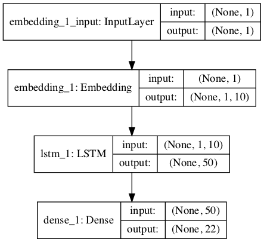

# How to Develop a Word-Based Neural Language Model
Language modeling involves predicting the next word in a sequence given the sequence of words
already present. A language model is a key element in many natural language processing models
such as machine translation and speech recognition. The choice of how the language model is
framed must match how the language model is intended to be used. In this tutorial, you will
discover how the framing of a language model affects the skill of the model when generating
short sequences from a nursery rhyme. After completing this tutorial, you will know:
- The challenge of developing a good framing of a word-based language model for a given
application.
- How to develop one-word, two-word, and line-based framings for word-based language
models.
- How to generate sequences using a fit language model.

Let's get started.

#### Pre-reqs:
- Google Chrome (Recommended)

#### Lab Environment
Notebooks are ready to run. All packages have been installed. There is no requirement for any setup.

**Note:** Elev8ed Notebooks (powered by Jupyter) will be accessible at the port given to you by your instructor. Password for jupyterLab : `1234`

All Notebooks are present in `work/deep-learning-for-nlp` folder.

You can access jupyter lab at `<host-ip>:<port>/lab/workspaces/lab12_Word_Based_Neural_Language_Model`


### Tutorial Overview

This tutorial is divided into the following parts:
1. Framing Language Modeling
2. Jack and Jill Nursery Rhyme
3. Model 1: One-Word-In, One-Word-Out Sequences
4. Model 2: Line-by-Line Sequence
5. Model 3: Two-Words-In, One-Word-Out Sequence

Framing Language Modeling

A statistical language model is learned from raw text and predicts the probability of the next
word in the sequence given the words already present in the sequence. Language models are
a key component in larger models for challenging natural language processing problems, like
machine translation and speech recognition. They can also be developed as standalone models
and used for generating new sequences that have the same statistical properties as the source
text.
Language models both learn and predict one word at a time. The training of the network
involves providing sequences of words as input that are processed one at a time where a prediction
can be made and learned for each input sequence. Similarly, when making predictions, the
process can be seeded with one or a few words, then predicted words can be gathered and
presented as input on subsequent predictions in order to build up a generated output sequence
Therefore, each model will involve splitting the source text into input and output sequences,
such that the model can learn to predict words. There are many ways to frame the sequences
from a source text for language modeling. In this tutorial, we will explore 3 different ways of
developing word-based language models in the Keras deep learning library. There is no single
best approach, just different framings that may suit different applications.

#### Jack and Jill Nursery Rhyme

Jack and Jill is a simple nursery rhyme. It is comprised of 4 lines, as follows:

```
Jack and Jill went up the hill
To fetch a pail of water
Jack fell down and broke his crown
And Jill came tumbling after

```

We will use this as our source text for exploring different framings of a word-based language
model. We can define this text in Python as follows:

```
# source text
data = """ Jack and Jill went up the hill\n
To fetch a pail of water\n
Jack fell down and broke his crown\n
And Jill came tumbling after\n """

```

### Model 1: One-Word-In, One-Word-Out Sequences

We can start with a very simple model. Given one word as input, the model will learn to predict
the next word in the sequence. For example:

```
X, y
Jack, and
and, Jill
Jill, went
...

```

The first step is to encode the text as integers. Each lowercase word in the source text is
assigned a unique integer and we can convert the sequences of words to sequences of integers.
Keras provides the Tokenizer class that can be used to perform this encoding. First, the
Tokenizer is fit on the source text to develop the mapping from words to unique integers. Then
sequences of text can be converted to sequences of integers by calling the texts to sequences()
function.

```
# integer encode text
tokenizer = Tokenizer()
tokenizer.fit_on_texts([data])
encoded = tokenizer.texts_to_sequences([data])[0]

```

We will need to know the size of the vocabulary later for both defining the word embedding
layer in the model, and for encoding output words using a one hot encoding. The size of the
vocabulary can be retrieved from the trained Tokenizer by accessing the word index attribute.

```
# determine the vocabulary size
vocab_size = len(tokenizer.word_index) + 1
print('Vocabulary Size: %d' % vocab_size)

```

Running this example, we can see that the size of the vocabulary is 21 words. We add one,
because we will need to specify the integer for the largest encoded word as an array index, e.g.
words encoded 1 to 21 with array indicies 0 to 21 or 22 positions. Next, we need to create
sequences of words to fit the model with one word as input and one word as output.

```
# create word -> word sequences
sequences = list()
for i in range(1, len(encoded)):
sequence = encoded[i-1:i+1]
sequences.append(sequence)
print('Total Sequences: %d' % len(sequences))

```

Running this piece shows that we have a total of 24 input-output pairs to train the network.

```
Total Sequences: 24

```

We can then split the sequences into input (X) and output elements (y). This is straightforward as we only have two columns in the data.

```
# split into X and y elements
sequences = array(sequences)
X, y = sequences[:,0],sequences[:,1]

```

### Model 1: One-Word-In, One-Word-Out Sequences

We will fit our model to predict a probability distribution across all words in the vocabulary.
That means that we need to turn the output element from a single integer into a one hot
encoding with a 0 for every word in the vocabulary and a 1 for the actual word that the value.
This gives the network a ground truth to aim for from which we can calculate error and update
the model. Keras provides the to categorical() function that we can use to convert the
integer to a one hot encoding while specifying the number of classes as the vocabulary size.

```
# one hot encode outputs
y = to_categorical(y, num_classes=vocab_size)

```

We are now ready to define the neural network model. The model uses a learned word
embedding in the input layer. This has one real-valued vector for each word in the vocabulary,
where each word vector has a specified length. In this case we will use a 10-dimensional
projection. The input sequence contains a single word, therefore the input length=1. The
model has a single hidden LSTM layer with 50 units. This is far more than is needed. The
output layer is comprised of one neuron for each word in the vocabulary and uses a softmax
activation function to ensure the output is normalized to look like a probability.

```
# define the model
def define_model(vocab_size):
model = Sequential()
model.add(Embedding(vocab_size, 10, input_length=1))
model.add(LSTM(50))
model.add(Dense(vocab_size, activation='softmax'))
# compile network
model.compile(loss='categorical_crossentropy', optimizer='adam', metrics=['accuracy'])
# summarize defined model
model.summary()
plot_model(model, to_file='model.png', show_shapes=True)
return model

```

The structure of the network can be summarized as follows:

```
_________________________________________________________________
Layer (type)
Output Shape
Param #
=================================================================
embedding_1 (Embedding)
(None, 1, 10)
220
_________________________________________________________________
lstm_1 (LSTM)
(None, 50)
12200
_________________________________________________________________
dense_1 (Dense)
(None, 22)
1122
=================================================================
Total params: 13,542
Trainable params: 13,542
Non-trainable params: 0
_________________________________________________________________

```

A plot the defined model is then saved to file with the name model.png.

## Model 1: One-Word-In, One-Word-Out Sequences




We will use this same general network structure for each example in this tutorial, with
minor changes to the learned embedding layer. We can compile and fit the network on the
encoded text data. Technically, we are modeling a multiclass classification problem (predict the
word in the vocabulary), therefore using the categorical cross entropy loss function. We use the
efficient Adam implementation of gradient descent and track accuracy at the end of each epoch.
The model is fit for 500 training epochs, again, perhaps more than is needed. The network
configuration was not tuned for this and later experiments; an over-prescribed configuration
was chosen to ensure that we could focus on the framing of the language model.
After the model is fit, we test it by passing it a given word from the vocabulary and
having the model predict the next word. Here we pass in 'Jack ' by encoding it and calling
model.predict classes() to get the integer output for the predicted word. This is then looked
up in the vocabulary mapping to give the associated word.

```
# evaluate
in_text = 'Jack'
print(in_text)
encoded = tokenizer.texts_to_sequences([in_text])[0]
encoded = array(encoded)
yhat = model.predict_classes(encoded, verbose=0)
for word, index in tokenizer.word_index.items():
if index == yhat:
print(word)

```

This process could then be repeated a few times to build up a generated sequence of words.
To make this easier, we wrap up the behavior in a function that we can call by passing in our
model and the seed word.

```
# generate a sequence from the model
def generate_seq(model, tokenizer, seed_text, n_words):
in_text, result = seed_text, seed_text
# generate a fixed number of words
for _ in range(n_words):
# encode the text as integer
encoded = tokenizer.texts_to_sequences([in_text])[0]
encoded = array(encoded)
# predict a word in the vocabulary
yhat = model.predict_classes(encoded, verbose=0)
# map predicted word index to word
out_word = ''
for word, index in tokenizer.word_index.items():
if index == yhat:
out_word = word
break
# append to input
in_text, result = out_word, result + ' ' + out_word
return result

```

We can tie all of this together. The complete code listing is provided below.

```
numpy import array
keras.preprocessing.text import Tokenizer
keras.utils import to_categorical
keras.utils.vis_utils import plot_model
keras.models import Sequential
keras.layers import Dense
keras.layers import LSTM
keras.layers import Embedding

# generate a sequence from the model
def generate_seq(model, tokenizer, seed_text, n_words):
in_text, result = seed_text, seed_text
# generate a fixed number of words
for _ in range(n_words):
# encode the text as integer
encoded = tokenizer.texts_to_sequences([in_text])[0]
encoded = array(encoded)
# predict a word in the vocabulary
yhat = model.predict_classes(encoded, verbose=0)
# map predicted word index to word
out_word = ''
for word, index in tokenizer.word_index.items():
if index == yhat:
out_word = word
break
# append to input
in_text, result = out_word, result + ' ' + out_word
return result
# define the model
def define_model(vocab_size):
model = Sequential()
model.add(Embedding(vocab_size, 10, input_length=1))
model.add(LSTM(50))
model.add(Dense(vocab_size, activation='softmax'))
# compile network
model.compile(loss='categorical_crossentropy', optimizer='adam', metrics=['accuracy'])
# summarize defined model
model.summary()
plot_model(model, to_file='model.png', show_shapes=True)
return model
# source text
data = """ Jack and Jill went up the hill\n
To fetch a pail of water\n
Jack fell down and broke his crown\n
And Jill came tumbling after\n """
# integer encode text
tokenizer = Tokenizer()
tokenizer.fit_on_texts([data])
encoded = tokenizer.texts_to_sequences([data])[0]
# determine the vocabulary size
vocab_size = len(tokenizer.word_index) + 1
print('Vocabulary Size: %d' % vocab_size)
# create word -> word sequences
sequences = list()
for i in range(1, len(encoded)):
sequence = encoded[i-1:i+1]
sequences.append(sequence)
print('Total Sequences: %d' % len(sequences))
# split into X and y elements
sequences = array(sequences)
X, y = sequences[:,0],sequences[:,1]
# one hot encode outputs
y = to_categorical(y, num_classes=vocab_size)
# define model
model = define_model(vocab_size)
# fit network
model.fit(X, y, epochs=500, verbose=2)
# evaluate
print(generate_seq(model, tokenizer, 'Jack', 6))

```

Running the example prints the loss and accuracy each training epoch.

```
...
Epoch 496/500
0s - loss: 0.2358
Epoch 497/500
0s - loss: 0.2355
Epoch 498/500
0s - loss: 0.2352
Epoch 499/500
0s - loss: 0.2349
Epoch 500/500
0s - loss: 0.2346

- acc: 0.8750
- acc: 0.8750
- acc: 0.8750
- acc: 0.8750
- acc: 0.8750

```

We can see that the model does not memorize the source sequences, likely because there is
some ambiguity in the input sequences, for example:

```
jack => and
jack => fell

```

And so on. At the end of the run, Jack is passed in and a prediction or new sequence is
generated. We get a reasonable sequence as output that has some elements of the source.
**Note:**  Given the stochastic nature of neural networks, your specific results may vary. Consider
running the example a few times.
Jack and jill came tumbling after down

This is a good first cut language model, but does not take full advantage of the LSTM's
ability to handle sequences of input and disambiguate some of the ambiguous pairwise sequences
by using a broader context.

# Model 2: Line-by-Line Sequence

Another approach is to split up the source text line-by-line, then break each line down into a
series of words that build up. For example:

```
X,
_, _, _, _, _, Jack,
_, _, _, _, Jack, and,
_, _, _, Jack, and, Jill,
_, _, Jack, and, Jill, went,
_, Jack, and, Jill, went, up,
Jack, and, Jill, went, up, the,

y
and
Jill
went
up
the
hill

```

This approach may allow the model to use the context of each line to help the model in those
cases where a simple one-word-in-and-out model creates ambiguity. In this case, this comes at
the cost of predicting words across lines, which might be fine for now if we are only interested
in modeling and generating lines of text. Note that in this representation, we will require a
padding of sequences to ensure they meet a fixed length input. This is a requirement when
using Keras. First, we can create the sequences of integers, line-by-line by using the Tokenizer
already fit on the source text.

```
# create line-based sequences
sequences = list()
for line in data.split('\n'):
encoded = tokenizer.texts_to_sequences([line])[0]
for i in range(1, len(encoded)):
sequence = encoded[:i+1]
sequences.append(sequence)
print('Total Sequences: %d' % len(sequences))

```

Next, we can pad the prepared sequences. We can do this using the pad sequences()
function provided in Keras. This first involves finding the longest sequence, then using that as
the length by which to pad-out all other sequences.

```
# pad input sequences
max_length = max([len(seq) for seq in sequences])
sequences = pad_sequences(sequences, maxlen=max_length, padding='pre')
print('Max Sequence Length: %d' % max_length)

```

Next, we can split the sequences into input and output elements, much like before.

```
# split into input and output elements
sequences = array(sequences)
X, y = sequences[:,:-1],sequences[:,-1]
y = to_categorical(y, num_classes=vocab_size)

```

The model can then be defined as before, except the input sequences are now longer than a
single word. Specifically, they are max length-1 in length, -1 because when we calculated the
maximum length of sequences, they included the input and output elements.

```
# define the model
def define_model(vocab_size, max_length):
model = Sequential()
model.add(Embedding(vocab_size, 10, input_length=max_length-1))
model.add(LSTM(50))
model.add(Dense(vocab_size, activation='softmax'))
# compile network
model.compile(loss='categorical_crossentropy', optimizer='adam', metrics=['accuracy'])
# summarize defined model
model.summary()
plot_model(model, to_file='model.png', show_shapes=True)
return model

```

We can use the model to generate new sequences as before. The generate seq() function
can be updated to build up an input sequence by adding predictions to the list of input words
each iteration.

```
# generate a sequence from a language model
def generate_seq(model, tokenizer, max_length, seed_text, n_words):
in_text = seed_text
# generate a fixed number of words
for _ in range(n_words):
# encode the text as integer
encoded = tokenizer.texts_to_sequences([in_text])[0]
# pre-pad sequences to a fixed length
encoded = pad_sequences([encoded], maxlen=max_length, padding='pre')
# predict probabilities for each word
yhat = model.predict_classes(encoded, verbose=0)
# map predicted word index to word
out_word = ''
for word, index in tokenizer.word_index.items():
if index == yhat:
out_word = word
break
# append to input
in_text += ' ' + out_word
return in_text

```

Tying all of this together, the complete code example is provided below.

```
numpy import array
keras.preprocessing.text import Tokenizer
keras.utils import to_categorical
keras.preprocessing.sequence import pad_sequences
keras.utils.vis_utils import plot_model
keras.models import Sequential
keras.layers import Dense
keras.layers import LSTM
keras.layers import Embedding

# generate a sequence from a language model
def generate_seq(model, tokenizer, max_length, seed_text, n_words):
in_text = seed_text
# generate a fixed number of words
for _ in range(n_words):
# encode the text as integer
encoded = tokenizer.texts_to_sequences([in_text])[0]
# pre-pad sequences to a fixed length
encoded = pad_sequences([encoded], maxlen=max_length, padding='pre')
# predict probabilities for each word
yhat = model.predict_classes(encoded, verbose=0)
# map predicted word index to word
out_word = ''
for word, index in tokenizer.word_index.items():
if index == yhat:
out_word = word
break
# append to input
in_text += ' ' + out_word
return in_text
# define the model
def define_model(vocab_size, max_length):
model = Sequential()
model.add(Embedding(vocab_size, 10, input_length=max_length-1))
model.add(LSTM(50))
model.add(Dense(vocab_size, activation='softmax'))
# compile network
model.compile(loss='categorical_crossentropy', optimizer='adam', metrics=['accuracy'])
# summarize defined model
model.summary()
plot_model(model, to_file='model.png', show_shapes=True)
return model
# source text
data = """ Jack and Jill went up the hill\n
To fetch a pail of water\n
Jack fell down and broke his crown\n
And Jill came tumbling after\n """
# prepare the tokenizer on the source text
tokenizer = Tokenizer()
tokenizer.fit_on_texts([data])
# determine the vocabulary size
vocab_size = len(tokenizer.word_index) + 1
print('Vocabulary Size: %d' % vocab_size)
# create line-based sequences
sequences = list()
for line in data.split('\n'):
encoded = tokenizer.texts_to_sequences([line])[0]
for i in range(1, len(encoded)):
sequence = encoded[:i+1]
sequences.append(sequence)
print('Total Sequences: %d' % len(sequences))
# pad input sequences
max_length = max([len(seq) for seq in sequences])
sequences = pad_sequences(sequences, maxlen=max_length, padding='pre')
print('Max Sequence Length: %d' % max_length)
# split into input and output elements
sequences = array(sequences)
X, y = sequences[:,:-1],sequences[:,-1]
y = to_categorical(y, num_classes=vocab_size)
# define model
model = define_model(vocab_size, max_length)
# fit network
model.fit(X, y, epochs=500, verbose=2)
# evaluate model
print(generate_seq(model, tokenizer, max_length-1, 'Jack', 4))
print(generate_seq(model, tokenizer, max_length-1, 'Jill', 4))

```

Running the example achieves a better fit on the source data. The added context has allowed
the model to disambiguate some of the examples. There are still two lines of text that start
with “Jack ” that may still be a problem for the network.

```
...
Epoch 496/500
0s - loss: 0.1039
Epoch 497/500
0s - loss: 0.1037
Epoch 498/500
0s - loss: 0.1035
Epoch 499/500
0s - loss: 0.1033
Epoch 500/500
0s - loss: 0.1032

- acc: 0.9524
- acc: 0.9524
- acc: 0.9524
- acc: 0.9524
- acc: 0.9524

```

At the end of the run, we generate two sequences with different seed words: Jack and Jill.
The first generated line looks good, directly matching the source text. The second is a bit
strange. This makes sense, because the network only ever saw Jill within an input sequence,
not at the beginning of the sequence, so it has forced an output to use the word Jill, i.e. the
last line of the rhyme.

**Note:**  Given the stochastic nature of neural networks, your specific results may vary. Consider
running the example a few times.

```
Jack fell down and broke
Jill jill came tumbling after

```

This was a good example of how the framing may result in better new lines, but not good
partial lines of input.

# Model 3: Two-Words-In, One-Word-Out Sequence

We can use an intermediate between the one-word-in and the whole-sentence-in approaches
and pass in a sub-sequences of words as input. This will provide a trade-off between the two
framings allowing new lines to be generated and for generation to be picked up mid line. We will
use 3 words as input to predict one word as output. The preparation of the sequences is much
like the first example, except with different offsets in the source sequence arrays, as follows:

```
# encode 2 words -> 1 word
sequences = list()
for i in range(2, len(encoded)):
sequence = encoded[i-2:i+1]
sequences.append(sequence)

```

The complete example is listed below

```
numpy import array
keras.preprocessing.text import Tokenizer
keras.utils import to_categorical
keras.preprocessing.sequence import pad_sequences
keras.utils.vis_utils import plot_model
keras.models import Sequential
keras.layers import Dense
keras.layers import LSTM
keras.layers import Embedding

# generate a sequence from a language model
def generate_seq(model, tokenizer, max_length, seed_text, n_words):
in_text = seed_text
# generate a fixed number of words
for _ in range(n_words):
# encode the text as integer
encoded = tokenizer.texts_to_sequences([in_text])[0]
# pre-pad sequences to a fixed length
encoded = pad_sequences([encoded], maxlen=max_length, padding='pre')
# predict probabilities for each word
yhat = model.predict_classes(encoded, verbose=0)
# map predicted word index to word
out_word = ''

for word, index in tokenizer.word_index.items():
if index == yhat:
out_word = word
break
# append to input
in_text += ' ' + out_word
return in_text
# define the model
def define_model(vocab_size, max_length):
model = Sequential()
model.add(Embedding(vocab_size, 10, input_length=max_length-1))
model.add(LSTM(50))
model.add(Dense(vocab_size, activation='softmax'))
# compile network
model.compile(loss='categorical_crossentropy', optimizer='adam', metrics=['accuracy'])
# summarize defined model
model.summary()
plot_model(model, to_file='model.png', show_shapes=True)
return model
# source text
data = """ Jack and Jill went up the hill\n
To fetch a pail of water\n
Jack fell down and broke his crown\n
And Jill came tumbling after\n """
# integer encode sequences of words
tokenizer = Tokenizer()
tokenizer.fit_on_texts([data])
encoded = tokenizer.texts_to_sequences([data])[0]
# retrieve vocabulary size
vocab_size = len(tokenizer.word_index) + 1
print('Vocabulary Size: %d' % vocab_size)
# encode 2 words -> 1 word
sequences = list()
for i in range(2, len(encoded)):
sequence = encoded[i-2:i+1]
sequences.append(sequence)
print('Total Sequences: %d' % len(sequences))
# pad sequences
max_length = max([len(seq) for seq in sequences])
sequences = pad_sequences(sequences, maxlen=max_length, padding='pre')
print('Max Sequence Length: %d' % max_length)
# split into input and output elements
sequences = array(sequences)
X, y = sequences[:,:-1],sequences[:,-1]
y = to_categorical(y, num_classes=vocab_size)
# define model
model = define_model(vocab_size, max_length)
# fit network
model.fit(X, y, epochs=500, verbose=2)
# evaluate model
print(generate_seq(model, tokenizer, max_length-1, 'Jack and', 5))
print(generate_seq(model, tokenizer, max_length-1, 'And Jill', 3))
print(generate_seq(model, tokenizer, max_length-1, 'fell down', 5))
print(generate_seq(model, tokenizer, max_length-1, 'pail of', 5))

```

Running the example again gets a good fit on the source text at around 95% accuracy.
**Note:**  Given the stochastic nature of neural networks, your specific results may vary. Consider
running the example a few times.

```
...
Epoch 496/500
0s - loss: 0.0685
Epoch 497/500
0s - loss: 0.0685
Epoch 498/500
0s - loss: 0.0684
Epoch 499/500
0s - loss: 0.0684
Epoch 500/500
0s - loss: 0.0684

- acc: 0.9565
- acc: 0.9565
- acc: 0.9565
- acc: 0.9565
- acc: 0.9565

```

We look at 4 generation examples, two start of line cases and two starting mid line.

```
Jack and jill
And Jill went
fell down and
pail of water

went up the hill
up the
broke his crown and
jack fell down and

```

The first start of line case generated correctly, but the second did not. The second case was
an example from the 4th line, which is ambiguous with content from the first line. Perhaps a
further expansion to 3 input words would be better. The two mid-line generation examples were
generated correctly, matching the source text.
We can see that the choice of how the language model is framed and the requirements on
how the model will be used must be compatible. That careful design is required when using
language models in general, perhaps followed-up by spot testing with sequence generation to
confirm model requirements have been met.


##### Run Notebook
Click notebook `1_model1.ipynb` in jupterLab UI and run jupyter notebook.

##### Run Notebook
Click notebook `2_model2.ipynb` in jupterLab UI and run jupyter notebook.

##### Run Notebook
Click notebook `3_model3.ipynb` in jupterLab UI and run jupyter notebook.

# Further Reading

This section provides more resources on the topic if you are looking go deeper.
- Jack and Jill on Wikipedia.
https://en.wikipedia.org/wiki/Jack_and_Jill_(nursery_rhyme)
- Language Model on Wikpedia.
https://en.wikipedia.org/wiki/Language_model
- Keras Embedding Layer API.
https://keras.io/layers/embeddings/#embedding
- Keras Text Processing API.
https://keras.io/preprocessing/text/
- Keras Sequence Processing API.
https://keras.io/preprocessing/sequence/
- Keras Utils API.
https://keras.io/utils/

# Summary

In this tutorial, you discovered how to develop different word-based language models for a simple
nursery rhyme. Specifically, you learned:
- The challenge of developing a good framing of a word-based language model for a given
application.
- How to develop one-word, two-word, and line-based framings for word-based language
models.
- How to generate sequences using a fit language model.
