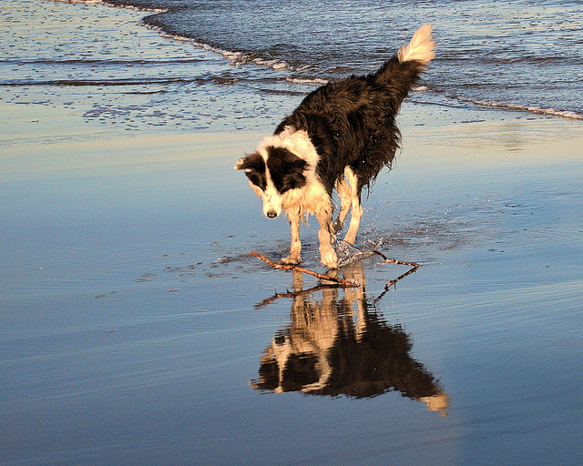
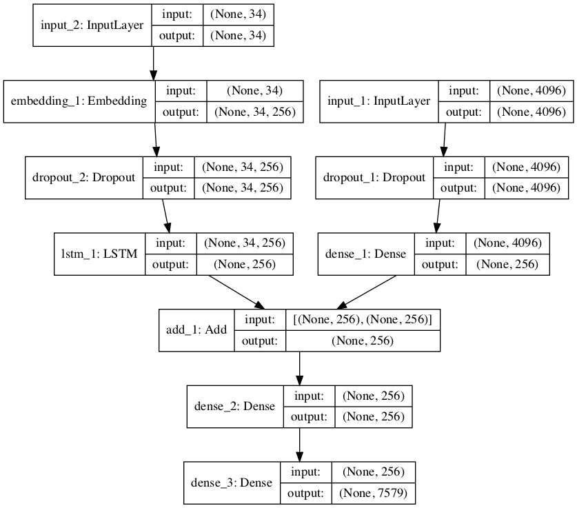

# Project: Develop a Neural Image Caption Generation Model
Caption generation is a challenging artificial intelligence problem where a textual description
must be generated for a given photograph. It requires both methods from computer vision to
understand the content of the image and a language model from the field of natural language
processing to turn the understanding of the image into words in the right order. Recently, deep
learning methods have achieved state-of-the-art results on examples of this problem.
Deep learning methods have demonstrated state-of-the-art results on caption generation
problems. What is most impressive about these methods is a single end-to-end model can be
defined to predict a caption, given a photo, instead of requiring sophisticated data preparation
or a pipeline of specifically designed models. In this tutorial, you will discover how to develop
a photo captioning deep learning model from scratch. After completing this tutorial, you will
know:
- How to prepare photo and text data for training a deep learning model.
- How to design and train a deep learning caption generation model.
- How to evaluate a train caption generation model and use it to caption entirely new
photographs.

Let's get started.

26.1

Tutorial Overview

This tutorial is divided into the following parts:
1. Photo and Caption Dataset
2. Prepare Photo Data
3. Prepare Text Data
4. Develop Deep Learning Model
5. Evaluate Model
6. Generate New Captions

# Photo and Caption Dataset

In this tutorial, we will use the Flickr8k dataset. This dataset was introduced in the previous lab.

#### Download Dataset
Dataset is very huge. Before running the notebook, download the dataset and unzip it.

`curl -L  https://github.com/jbrownlee/Datasets/releases/download/Flickr8k/Flickr8k_Dataset.zip -o Flickr8k_Dataset.zip`

`unzip Flickr8k_Dataset.zip`

Within a short time, you will receive an email that contains links to two files:
- Flickr8k Dataset.zip (1 Gigabyte) An archive of all photographs.
- Flickr8k text.zip (2.2 Megabytes) An archive of all text descriptions for photographs.

Download the datasets and unzip them into your current working directory. You will have
two directories:
- Flicker8k Dataset: Contains 8092 photographs in JPEG format (yes the directory name
spells it 'Flicker' not 'Flickr').
- Flickr8k text: Contains a number of files containing different sources of descriptions for
the photographs.

The dataset has a pre-defined training dataset (6,000 images), development dataset (1,000
images), and test dataset (1,000 images). One measure that can be used to evaluate the skill of
the model are BLEU scores. For reference, below are some ball-park BLEU scores for skillful
models when evaluated on the test dataset (taken from the 2017 paper Where to put the Image
in an Image Caption Generator ):
- BLEU-1: 0.401 to 0.578.
- BLEU-2: 0.176 to 0.390.
- BLEU-3: 0.099 to 0.260.
- BLEU-4: 0.059 to 0.170.

We describe the BLEU metric more later when we work on evaluating our model. Next, let's
look at how to load the images.

# Prepare Photo Data

We will use a pre-trained model to interpret the content of the photos. There are many models
to choose from. In this case, we will use the Oxford Visual Geometry Group, or VGG, model
that won the ImageNet competition in 2014. Keras provides this pre-trained model directly.
Note, the first time you use this model, Keras will download the model weights from the Internet,
which are about 500 Megabytes. This may take a few minutes depending on your internet
connection.

We could use this model as part of a broader image caption model. The problem is, it
is a large model and running each photo through the network every time we want to test a
new language model configuration (downstream) is redundant. Instead, we can pre-compute
the photo features using the pre-trained model and save them to file. We can then load these
features later and feed them into our model as the interpretation of a given photo in the dataset.

It is no different to running the photo through the full VGG model; it is just we will have done
it once in advance.
This is an optimization that will make training our models faster and consume less memory.
We can load the VGG model in Keras using the VGG class. We will remove the last layer from
the loaded model, as this is the model used to predict a classification for a photo. We are not
interested in classifying images, but we are interested in the internal representation of the photo
right before a classification is made. These are the features that the model has extracted from
the photo.
Keras also provides tools for reshaping the loaded photo into the preferred size for the model
(e.g. 3 channel 224 x 224 pixel image). Below is a function named extract features() that,
given a directory name, will load each photo, prepare it for VGG, and collect the predicted
features from the VGG model. The image features are a 1-dimensional 4,096 element vector.
The function returns a dictionary of image identifier to image features.

```
# extract features from each photo in the directory
def extract_features(directory):
# load the model
model = VGG16()
# re-structure the model
model.layers.pop()
model = Model(inputs=model.inputs, outputs=model.layers[-1].output)
# summarize
model.summary()
# extract features from each photo
features = dict()
for name in listdir(directory):
# load an image from file
filename = directory + '/' + name
image = load_img(filename, target_size=(224, 224))
# convert the image pixels to a NumPy array
image = img_to_array(image)
# reshape data for the model
image = image.reshape((1, image.shape[0], image.shape[1], image.shape[2]))
# prepare the image for the VGG model
image = preprocess_input(image)
# get features
feature = model.predict(image, verbose=0)
# get image id
image_id = name.split('.')[0]
# store feature
features[image_id] = feature
print('>%s' % name)
return features

```

We can call this function to prepare the photo data for testing our models, then save the
resulting dictionary to a file named features.pkl. The complete example is listed below.

```
from
from
from
from
from
from
from
from

os import listdir
os import path
pickle import dump
keras.applications.vgg16 import VGG16
keras.preprocessing.image import load_img
keras.preprocessing.image import img_to_array
keras.applications.vgg16 import preprocess_input
keras.models import Model

# extract features from each photo in the directory
def extract_features(directory):
# load the model
model = VGG16()
# re-structure the model
model.layers.pop()
model = Model(inputs=model.inputs, outputs=model.layers[-1].output)
# summarize
model.summary()
# extract features from each photo
features = dict()
for name in listdir(directory):
# load an image from file
filename = path.join(directory, name)
image = load_img(filename, target_size=(224, 224))
# convert the image pixels to a numpy array
image = img_to_array(image)
# reshape data for the model
image = image.reshape((1, image.shape[0], image.shape[1], image.shape[2]))
# prepare the image for the VGG model
image = preprocess_input(image)
# get features
feature = model.predict(image, verbose=0)
# get image id
image_id = name.split('.')[0]
# store feature
features[image_id] = feature
print('>%s' % name)
return features
# extract features from all images
directory = 'Flicker8k_Dataset'
features = extract_features(directory)
print('Extracted Features: %d' % len(features))
# save to file
dump(features, open('features.pkl', 'wb'))

```

Running this data preparation step may take a while depending on your hardware, perhaps
one hour on the CPU with a modern workstation. At the end of the run, you will have
the extracted features stored in features.pkl for later use. This file will be a few hundred
Megabytes in size.

26.4

Prepare Text Data

The dataset contains multiple descriptions for each photograph and the text of the descriptions
requires some minimal cleaning. Note, a fuller investigation into how this text data can
be prepared was described in Chapter 25. First, we will load the file containing all of the
descriptions.

```
# load doc into memory
def load_doc(filename):
# open the file as read only
file = open(filename, 'r')
# read all text
text = file.read()
# close the file
file.close()
return text
filename = 'Flickr8k_text/Flickr8k.token.txt'
# load descriptions
doc = load_doc(filename)

```

Each photo has a unique identifier. This identifier is used on the photo filename and in the
text file of descriptions. Next, we will step through the list of photo descriptions. Below defines
a function load descriptions() that, given the loaded document text, will return a dictionary
of photo identifiers to descriptions. Each photo identifier maps to a list of one or more textual
descriptions.

```
# extract descriptions for images
def load_descriptions(doc):
mapping = dict()
# process lines
for line in doc.split('\n'):
# split line by white space
tokens = line.split()
if len(line) < 2:
continue
# take the first token as the image id, the rest as the description
image_id, image_desc = tokens[0], tokens[1:]
# remove filename from image id
image_id = image_id.split('.')[0]
# convert description tokens back to string
image_desc = ' '.join(image_desc)
# create the list if needed
if image_id not in mapping:
mapping[image_id] = list()
# store description
mapping[image_id].append(image_desc)
return mapping
# parse descriptions
descriptions = load_descriptions(doc)
print('Loaded: %d ' % len(descriptions))

```

Next, we need to clean the description text. The descriptions are already tokenized and easy
to work with. We will clean the text in the following ways in order to reduce the size of the
vocabulary of words we will need to work with:
- Convert all words to lowercase.
- Remove all punctuation.
- Remove all words that are one character or less in length (e.g. 'a').
- Remove all words with numbers in them.

Below defines the clean descriptions() function that, given the dictionary of image
identifiers to descriptions, steps through each description and cleans the text.

```
def clean_descriptions(descriptions):
# prepare regex for char filtering
re_punc = re.compile('[%s]' % re.escape(string.punctuation))
for key, desc_list in descriptions.items():
for i in range(len(desc_list)):
desc = desc_list[i]
# tokenize
desc = desc.split()
# convert to lower case
desc = [word.lower() for word in desc]
# remove punctuation from each token
desc = [re_punc.sub('', w) for w in desc]
# remove hanging 's' and 'a'
desc = [word for word in desc if len(word)>1]
# remove tokens with numbers in them
desc = [word for word in desc if word.isalpha()]
# store as string
desc_list[i] = ' '.join(desc)
# clean descriptions
clean_descriptions(descriptions)

```

Once cleaned, we can summarize the size of the vocabulary. Ideally, we want a vocabulary
that is both expressive and as small as possible. A smaller vocabulary will result in a smaller
model that will train faster. For reference, we can transform the clean descriptions into a set
and print its size to get an idea of the size of our dataset vocabulary.

```
# convert the loaded descriptions into a vocabulary of words
def to_vocabulary(descriptions):
# build a list of all description strings
all_desc = set()
for key in descriptions.keys():
[all_desc.update(d.split()) for d in descriptions[key]]
return all_desc
# summarize vocabulary
vocabulary = to_vocabulary(descriptions)
print('Vocabulary Size: %d' % len(vocabulary))

```

Finally, we can save the dictionary of image identifiers and descriptions to a new file
named descriptions.txt, with one image identifier and description per line. Below defines the
save doc() function that, given a dictionary containing the mapping of identifiers to descriptions
and a filename, saves the mapping to file.

```
# save descriptions to file, one per line
def save_descriptions(descriptions, filename):
lines = list()
for key, desc_list in descriptions.items():
for desc in desc_list:
lines.append(key + ' ' + desc)
data = '\n'.join(lines)
file = open(filename, 'w')
file.write(data)
file.close()
# save descriptions
save_doc(descriptions, 'descriptions.txt')

```

Putting this all together, the complete listing is provided below.

```
import string
import re
# load doc into memory
def load_doc(filename):
# open the file as read only
file = open(filename, 'r')
# read all text
text = file.read()
# close the file
file.close()
return text
# extract descriptions for images
def load_descriptions(doc):
mapping = dict()
# process lines
for line in doc.split('\n'):
# split line by white space

26.4. Prepare Text Data
tokens = line.split()
if len(line) < 2:
continue
# take the first token as the image id, the rest as the description
image_id, image_desc = tokens[0], tokens[1:]
# remove filename from image id
image_id = image_id.split('.')[0]
# convert description tokens back to string
image_desc = ' '.join(image_desc)
# create the list if needed
if image_id not in mapping:
mapping[image_id] = list()
# store description
mapping[image_id].append(image_desc)
return mapping
def clean_descriptions(descriptions):
# prepare regex for char filtering
re_punc = re.compile('[%s]' % re.escape(string.punctuation))
for _, desc_list in descriptions.items():
for i in range(len(desc_list)):
desc = desc_list[i]
# tokenize
desc = desc.split()
# convert to lower case
desc = [word.lower() for word in desc]
# remove punctuation from each token
desc = [re_punc.sub('', w) for w in desc]
# remove hanging 's' and 'a'
desc = [word for word in desc if len(word)>1]
# remove tokens with numbers in them
desc = [word for word in desc if word.isalpha()]
# store as string
desc_list[i] = ' '.join(desc)
# convert the loaded descriptions into a vocabulary of words
def to_vocabulary(descriptions):
# build a list of all description strings
all_desc = set()
for key in descriptions.keys():
[all_desc.update(d.split()) for d in descriptions[key]]
return all_desc
# save descriptions to file, one per line
def save_descriptions(descriptions, filename):
lines = list()
for key, desc_list in descriptions.items():
for desc in desc_list:
lines.append(key + ' ' + desc)
data = '\n'.join(lines)
file = open(filename, 'w')
file.write(data)
file.close()
filename = 'Flickr8k_text/Flickr8k.token.txt'
# load descriptions
doc = load_doc(filename)
# parse descriptions
descriptions = load_descriptions(doc)
print('Loaded: %d ' % len(descriptions))
# clean descriptions
clean_descriptions(descriptions)
# summarize vocabulary
vocabulary = to_vocabulary(descriptions)
print('Vocabulary Size: %d' % len(vocabulary))
# save to file
save_descriptions(descriptions, 'descriptions.txt')

```

Running the example first prints the number of loaded photo descriptions (8,092) and the
size of the clean vocabulary (8,763 words).

```
Loaded: 8,092
Vocabulary Size: 8,763

```

Finally, the clean descriptions are written to descriptions.txt. Taking a look at the file,
we can see that the descriptions are ready for modeling. The order of descriptions in your file
may vary.

```
2252123185_487f21e336
2252123185_487f21e336
2252123185_487f21e336
2252123185_487f21e336
2252123185_487f21e336
...

bunch on people are seated in stadium
crowded stadium is full of people watching an event
crowd of people fill up packed stadium
crowd sitting in an indoor stadium
stadium full of people watch game

```


26.5

Develop Deep Learning Model

In this section, we will define the deep learning model and fit it on the training dataset. This
section is divided into the following parts:
1. Loading Data.
2. Defining the Model.
3. Fitting the Model.
4. Complete Example.

26.5.1

Loading Data

First, we must load the prepared photo and text data so that we can use it to fit the model.
We are going to train the data on all of the photos and captions in the training dataset. While
training, we are going to monitor the performance of the model on the development dataset and
use that performance to decide when to save models to file.
The train and development dataset have been predefined in the Flickr 8k.trainImages.txt
and Flickr 8k.devImages.txt files respectively, that both contain lists of photo file names.
From these file names, we can extract the photo identifiers and use these identifiers to filter
photos and descriptions for each set. The function load set() below will load a pre-defined set
of identifiers given the train or development sets filename.

```
# load doc into memory
def load_doc(filename):
# open the file as read only
file = open(filename, 'r')
# read all text
text = file.read()
# close the file
file.close()
return text
# load a pre-defined list of photo identifiers
def load_set(filename):
doc = load_doc(filename)
dataset = list()
# process line by line
for line in doc.split('\n'):
# skip empty lines
if len(line) < 1:
continue
# get the image identifier
identifier = line.split('.')[0]
dataset.append(identifier)
return set(dataset)

```

Now, we can load the photos and descriptions using the pre-defined set of train or development
identifiers. Below is the function load clean descriptions() that loads the cleaned text
descriptions from descriptions.txt for a given set of identifiers and returns a dictionary of
identifiers to lists of text descriptions.
The model we will develop will generate a caption given a photo, and the caption will be
generated one word at a time. The sequence of previously generated words will be provided as
input. Therefore, we will need a first word to kick-off the generation process and a last word to
signal the end of the caption. We will use the strings startseq and endseq for this purpose.
These tokens are added to the loaded descriptions as they are loaded. It is important to do this
now before we encode the text so that the tokens are also encoded correctly.

```
# load clean descriptions into memory
def load_clean_descriptions(filename, dataset):
# load document
doc = load_doc(filename)
descriptions = dict()
for line in doc.split('\n'):
# split line by white space
tokens = line.split()
# split id from description
image_id, image_desc = tokens[0], tokens[1:]
# skip images not in the set
if image_id in dataset:
# create list
if image_id not in descriptions:
descriptions[image_id] = list()
# wrap description in tokens
desc = 'startseq ' + ' '.join(image_desc) + ' endseq'
# store
descriptions[image_id].append(desc)
return descriptions

```

Next, we can load the photo features for a given dataset. Below defines a function named
load photo features() that loads the entire set of photo descriptions, then returns the subset
of interest for a given set of photo identifiers. This is not very efficient; nevertheless, this will
get us up and running quickly.

```
# load photo features
def load_photo_features(filename, dataset):
# load all features
all_features = load(open(filename, 'rb'))
# filter features
features = {k: all_features[k] for k in dataset}
return features

```

We can pause here and test everything developed so far. The complete code example is
listed below.

```
from pickle import load
# load doc into memory
def load_doc(filename):
# open the file as read only
file = open(filename, 'r')
# read all text
text = file.read()
# close the file
file.close()
return text
# load a pre-defined list of photo identifiers
def load_set(filename):
doc = load_doc(filename)
dataset = list()
# process line by line
for line in doc.split('\n'):
# skip empty lines
if len(line) < 1:
continue
# get the image identifier
identifier = line.split('.')[0]
dataset.append(identifier)
return set(dataset)
# load clean descriptions into memory
def load_clean_descriptions(filename, dataset):
# load document
doc = load_doc(filename)
descriptions = dict()
for line in doc.split('\n'):
# split line by white space
tokens = line.split()
# split id from description
image_id, image_desc = tokens[0], tokens[1:]
# skip images not in the set
if image_id in dataset:
# create list
if image_id not in descriptions:
descriptions[image_id] = list()
# wrap description in tokens
desc = 'startseq ' + ' '.join(image_desc) + ' endseq'
# store
descriptions[image_id].append(desc)
return descriptions
# load photo features
def load_photo_features(filename, dataset):
# load all features
all_features = load(open(filename, 'rb'))
# filter features
features = {k: all_features[k] for k in dataset}
return features
# load training dataset (6K)
filename = 'Flickr8k_text/Flickr_8k.trainImages.txt'
train = load_set(filename)
print('Dataset: %d' % len(train))
# descriptions
train_descriptions = load_clean_descriptions('descriptions.txt', train)
print('Descriptions: train=%d' % len(train_descriptions))
# photo features
train_features = load_photo_features('features.pkl', train)
print('Photos: train=%d' % len(train_features))

```

Running this example first loads the 6,000 photo identifiers in the test dataset. These
features are then used to filter and load the cleaned description text and the pre-computed
photo features. We are nearly there.

```
Dataset: 6,000
Descriptions: train=6,000
Photos: train=6,000

```

The description text will need to be encoded to numbers before it can be presented to
the model as in input or compared to the model's predictions. The first step in encoding the
data is to create a consistent mapping from words to unique integer values. Keras provides
the Tokenizer class that can learn this mapping from the loaded description data. Below
defines the to lines() to convert the dictionary of descriptions into a list of strings and the
create tokenizer() function that will fit a Tokenizer given the loaded photo description text.

```
# convert a dictionary of clean descriptions to a list of descriptions
def to_lines(descriptions):
all_desc = list()
for key in descriptions.keys():
[all_desc.append(d) for d in descriptions[key]]
return all_desc
# fit a tokenizer given caption descriptions
def create_tokenizer(descriptions):
lines = to_lines(descriptions)
tokenizer = Tokenizer()
tokenizer.fit_on_texts(lines)
return tokenizer
# prepare tokenizer
tokenizer = create_tokenizer(train_descriptions)
vocab_size = len(tokenizer.word_index) + 1
print('Vocabulary Size: %d' % vocab_size)

```

We can now encode the text. Each description will be split into words. The model will be
provided one word and the photo and generate the next word. Then the first two words of the
description will be provided to the model as input with the image to generate the next word.
This is how the model will be trained. For example, the input sequence “little girl running in
field ” would be split into 6 input-output pairs to train the model:

```
X1,
photo
photo
photo
photo
photo
photo

X2 (text sequence),
startseq,
startseq, little,
startseq, little, girl,
startseq, little, girl, running,
startseq, little, girl, running, in,
startseq, little, girl, running, in, field,

y (word)
little
girl
running
in
field
endseq

```

sequences
Later, when the model is used to generate descriptions, the generated words will be concatenated and recursively provided as input to generate a caption for an image. The function
below named create sequences(), given the tokenizer, a maximum sequence length, and the
dictionary of all descriptions and photos, will transform the data into input-output pairs of data
for training the model. There are two input arrays to the model: one for photo features and
one for the encoded text. There is one output for the model which is the encoded next word in
the text sequence.
The input text is encoded as integers, which will be fed to a word embedding layer. The
photo features will be fed directly to another part of the model. The model will output a
prediction, which will be a probability distribution over all words in the vocabulary. The
output data will therefore be a one hot encoded version of each word, representing an idealized
probability distribution with 0 values at all word positions except the actual word position,
which has a value of 1.

```
# create sequences of images, input sequences and output words for an image
def create_sequences(tokenizer, max_length, descriptions, photos):
X1, X2, y = list(), list(), list()
# walk through each image identifier
for key, desc_list in descriptions.items():
# walk through each description for the image
for desc in desc_list:
# encode the sequence
seq = tokenizer.texts_to_sequences([desc])[0]
# split one sequence into multiple X,y pairs
for i in range(1, len(seq)):
# split into input and output pair
in_seq, out_seq = seq[:i], seq[i]
# pad input sequence
in_seq = pad_sequences([in_seq], maxlen=max_length)[0]
# encode output sequence
out_seq = to_categorical([out_seq], num_classes=vocab_size)[0]
# store
X1.append(photos[key][0])
X2.append(in_seq)
y.append(out_seq)
return array(X1), array(X2), array(y)

```

We will need to calculate the maximum number of words in the longest description. A short
helper function named max length() is defined below.

```
# calculate the length of the description with the most words
def max_length(descriptions):
lines = to_lines(descriptions)
return max(len(d.split()) for d in lines)

```

We now have enough to load the data for the training and development datasets and
transform the loaded data into input-output pairs for fitting a deep learning model.

26.5.2

Defining the Model

We will define a deep learning based on the merge-model described by Marc Tanti, et al. in
their 2017 papers. Note, the merge model for image captioning was introduced in Chapter 22.
We will describe the model in three parts:
- Photo Feature Extractor. This is a 16-layer VGG model pre-trained on the ImageNet
dataset. We have pre-processed the photos with the VGG model (without the output
layer) and will use the extracted features predicted by this model as input.
- Sequence Processor. This is a word embedding layer for handling the text input,
followed by a Long Short-Term Memory (LSTM) recurrent neural network layer.

26.5. Develop Deep Learning Model

312

- Decoder (for lack of a better name). Both the feature extractor and sequence processor
output a fixed-length vector. These are merged together and processed by a Dense layer
to make a final prediction.

The Photo Feature Extractor model expects input photo features to be a vector of 4,096
elements. These are processed by a Dense layer to produce a 256 element representation of the
photo. The Sequence Processor model expects input sequences with a pre-defined length (34
words) which are fed into an Embedding layer that uses a mask to ignore padded values. This is
followed by an LSTM layer with 256 memory units.
Both the input models produce a 256 element vector. Further, both input models use
regularization in the form of 50% dropout. This is to reduce overfitting the training dataset, as
this model configuration learns very fast. The Decoder model merges the vectors from both
input models using an addition operation. This is then fed to a Dense 256 neuron layer and then
to a final output Dense layer that makes a softmax prediction over the entire output vocabulary
for the next word in the sequence. The function below named define model() defines and
returns the model ready to be fit.

```
# define the captioning model
def define_model(vocab_size, max_length):
# feature extractor model
inputs1 = Input(shape=(4096,))
fe1 = Dropout(0.5)(inputs1)
fe2 = Dense(256, activation='relu')(fe1)
# sequence model
inputs2 = Input(shape=(max_length,))
se1 = Embedding(vocab_size, 256, mask_zero=True)(inputs2)
se2 = Dropout(0.5)(se1)
se3 = LSTM(256)(se2)
# decoder model
decoder1 = add([fe2, se3])
decoder2 = Dense(256, activation='relu')(decoder1)
outputs = Dense(vocab_size, activation='softmax')(decoder2)
# tie it together [image, seq] [word]
model = Model(inputs=[inputs1, inputs2], outputs=outputs)
# compile model
model.compile(loss='categorical_crossentropy', optimizer='adam')
# summarize model
model.summary()
plot_model(model, to_file='model.png', show_shapes=True)
return model

```

A plot of the model is created and helps to better understand the structure of the network
and the two streams of input.




26.5.3

Fitting the Model

Now that we know how to define the model, we can fit it on the training dataset. The model
learns fast and quickly overfits the training dataset. For this reason, we will monitor the skill
of the trained model on the holdout development dataset. When the skill of the model on the
development dataset improves at the end of an epoch, we will save the whole model to file.
At the end of the run, we can then use the saved model with the best skill on the training
dataset as our final model. We can do this by defining a ModelCheckpoint in Keras and
specifying it to monitor the minimum loss on the validation dataset and save the model to a file
that has both the training and validation loss in the filename.

```
# define checkpoint callback
checkpoint = ModelCheckpoint('model.h5', monitor='val_loss', verbose=1,
save_best_only=True, mode='min')

```

We can then specify the checkpoint in the call to fit() via the callbacks argument. We
must also specify the development dataset in fit() via the validation data argument. We
will only fit the model for 20 epochs, but given the amount of training data, each epoch may
take 30 minutes on modern hardware.

```
# fit model
model.fit([X1train, X2train], ytrain, epochs=20, verbose=2, callbacks=[checkpoint],
validation_data=([X1test, X2test], ytest))

```


Complete Example

The complete example for fitting the model on the training data is listed below. Note, running
this example may require a machine with 8 or more Gigabytes of RAM. See the appendix for
using AWS, if needed.

```
from
from
from
from
from
from
from
from
from
from
from
from
from
from

numpy import array
pickle import load
keras.preprocessing.text import Tokenizer
keras.preprocessing.sequence import pad_sequences
keras.utils import to_categorical
keras.utils import plot_model
keras.models import Model
keras.layers import Input
keras.layers import Dense
keras.layers import LSTM
keras.layers import Embedding
keras.layers import Dropout
keras.layers.merge import add
keras.callbacks import ModelCheckpoint

# load doc into memory
def load_doc(filename):
# open the file as read only
file = open(filename, 'r')
# read all text
text = file.read()
# close the file
file.close()
return text
# load a pre-defined list of photo identifiers
def load_set(filename):
doc = load_doc(filename)
dataset = list()
# process line by line
for line in doc.split('\n'):
# skip empty lines
if len(line) < 1:
continue
# get the image identifier
identifier = line.split('.')[0]
dataset.append(identifier)
return set(dataset)
# load clean descriptions into memory
def load_clean_descriptions(filename, dataset):
# load document
doc = load_doc(filename)
descriptions = dict()
for line in doc.split('\n'):
# split line by white space
tokens = line.split()
# split id from description
image_id, image_desc = tokens[0], tokens[1:]
# skip images not in the set
if image_id in dataset:
# create list
if image_id not in descriptions:
descriptions[image_id] = list()
# wrap description in tokens
desc = 'startseq ' + ' '.join(image_desc) + ' endseq'
# store
descriptions[image_id].append(desc)
return descriptions
# load photo features
def load_photo_features(filename, dataset):
# load all features
all_features = load(open(filename, 'rb'))
# filter features
features = {k: all_features[k] for k in dataset}
return features
# covert a dictionary of clean descriptions to a list of descriptions
def to_lines(descriptions):
all_desc = list()
for key in descriptions.keys():
[all_desc.append(d) for d in descriptions[key]]
return all_desc
# fit a tokenizer given caption descriptions
def create_tokenizer(descriptions):
lines = to_lines(descriptions)
tokenizer = Tokenizer()
tokenizer.fit_on_texts(lines)
return tokenizer
# calculate the length of the description with the most words
def max_length(descriptions):
lines = to_lines(descriptions)
return max(len(d.split()) for d in lines)
# create sequences of images, input sequences and output words for an image
def create_sequences(tokenizer, max_length, descriptions, photos):
X1, X2, y = list(), list(), list()
# walk through each image identifier
for key, desc_list in descriptions.items():
# walk through each description for the image
for desc in desc_list:
# encode the sequence
seq = tokenizer.texts_to_sequences([desc])[0]
# split one sequence into multiple X,y pairs
for i in range(1, len(seq)):
# split into input and output pair
in_seq, out_seq = seq[:i], seq[i]
# pad input sequence
in_seq = pad_sequences([in_seq], maxlen=max_length)[0]
# encode output sequence
out_seq = to_categorical([out_seq], num_classes=vocab_size)[0]
# store
X1.append(photos[key][0])
X2.append(in_seq)
y.append(out_seq)
return array(X1), array(X2), array(y)
# define the captioning model
def define_model(vocab_size, max_length):
# feature extractor model
inputs1 = Input(shape=(4096,))
fe1 = Dropout(0.5)(inputs1)
fe2 = Dense(256, activation='relu')(fe1)
# sequence model
inputs2 = Input(shape=(max_length,))
se1 = Embedding(vocab_size, 256, mask_zero=True)(inputs2)
se2 = Dropout(0.5)(se1)
se3 = LSTM(256)(se2)
# decoder model
decoder1 = add([fe2, se3])
decoder2 = Dense(256, activation='relu')(decoder1)
outputs = Dense(vocab_size, activation='softmax')(decoder2)
# tie it together [image, seq] [word]
model = Model(inputs=[inputs1, inputs2], outputs=outputs)
# compile model
model.compile(loss='categorical_crossentropy', optimizer='adam')
# summarize model
model.summary()
plot_model(model, to_file='model.png', show_shapes=True)
return model
# load training dataset (6K)
filename = 'Flickr8k_text/Flickr_8k.trainImages.txt'
train = load_set(filename)
print('Dataset: %d' % len(train))
# descriptions
train_descriptions = load_clean_descriptions('descriptions.txt', train)
print('Descriptions: train=%d' % len(train_descriptions))
# photo features
train_features = load_photo_features('features.pkl', train)
print('Photos: train=%d' % len(train_features))
# prepare tokenizer
tokenizer = create_tokenizer(train_descriptions)
vocab_size = len(tokenizer.word_index) + 1
print('Vocabulary Size: %d' % vocab_size)
# determine the maximum sequence length
max_length = max_length(train_descriptions)
print('Description Length: %d' % max_length)
# prepare sequences
X1train, X2train, ytrain = create_sequences(tokenizer, max_length, train_descriptions,
train_features)
# load test set
filename = 'Flickr8k_text/Flickr_8k.devImages.txt'
test = load_set(filename)
print('Dataset: %d' % len(test))
# descriptions
test_descriptions = load_clean_descriptions('descriptions.txt', test)
print('Descriptions: test=%d' % len(test_descriptions))
# photo features
test_features = load_photo_features('features.pkl', test)
print('Photos: test=%d' % len(test_features))
# prepare sequences
X1test, X2test, ytest = create_sequences(tokenizer, max_length, test_descriptions,
test_features)
# define the model
model = define_model(vocab_size, max_length)
# define checkpoint callback
checkpoint = ModelCheckpoint('model.h5', monitor='val_loss', verbose=1,
save_best_only=True, mode='min')
# fit model
model.fit([X1train, X2train], ytrain, epochs=20, verbose=2, callbacks=[checkpoint],
validation_data=([X1test, X2test], ytest))

```

Running the example first prints a summary of the loaded training and development datasets.

```
Dataset: 6,000
Descriptions: train=6,000
Photos: train=6,000
Vocabulary Size: 7,579
Description Length: 34
Dataset: 1,000
Descriptions: test=1,000
Photos: test=1,000
Train on 306,404 samples, validate on 50,903 samples

```

After the summary of the model, we can get an idea of the total number of training and
validation (development) input-output pairs. The model then runs, saving the best model to
.h5 files along the way. Note, that even on a modern CPU, each epoch may take 20 minutes.
You may want to consider running the example on a GPU, such as on AWS. See the appendix
for details on how to set this up. When I ran the example, the best model was saved at the end
of epoch 2 with a loss of 3.245 on the training dataset and a loss of 3.612 on the development
dataset.

26.6

Evaluate Model

Once the model is fit, we can evaluate the skill of its predictions on the holdout test dataset.
We will evaluate a model by generating descriptions for all photos in the test dataset and
evaluating those predictions with a standard cost function. First, we need to be able to generate
a description for a photo using a trained model.
This involves passing in the start description token startseq, generating one word, then
calling the model recursively with generated words as input until the end of sequence token
is reached endseq or the maximum description length is reached. The function below named
generate desc() implements this behavior and generates a textual description given a trained
model, and a given prepared photo as input. It calls the function word for id() in order to
map an integer prediction back to a word.

```
# map an integer to a word
def word_for_id(integer, tokenizer):
for word, index in tokenizer.word_index.items():
if index == integer:
return word
return None
# generate a description for an image
def generate_desc(model, tokenizer, photo, max_length):
# seed the generation process
in_text = 'startseq'
# iterate over the whole length of the sequence
for i in range(max_length):
# integer encode input sequence
sequence = tokenizer.texts_to_sequences([in_text])[0]
# pad input
sequence = pad_sequences([sequence], maxlen=max_length)
# predict next word
yhat = model.predict([photo,sequence], verbose=0)
# convert probability to integer
yhat = argmax(yhat)
# map integer to word
word = word_for_id(yhat, tokenizer)
# stop if we cannot map the word
if word is None:
break
# append as input for generating the next word
in_text += ' ' + word
# stop if we predict the end of the sequence
if word == 'endseq':
break
return in_text

```

When generating and comparing photo descriptions, we will need to strip off the special
start and end of sequence words. The function below named cleanup summary() will perform
this operation.

```
# remove start/end sequence tokens from a summary
def cleanup_summary(summary):
# remove start of sequence token
index = summary.find('startseq ')
if index > -1:
summary = summary[len('startseq '):]
# remove end of sequence token
index = summary.find(' endseq')
if index > -1:
summary = summary[:index]
return summary

```

We will generate predictions for all photos in the test dataset. The function below named
evaluate model() will evaluate a trained model against a given dataset of photo descriptions
and photo features. The actual and predicted descriptions are collected and evaluated collectively
using the corpus BLEU score that summarizes how close the generated text is to the expected
text.

```
# evaluate the skill of the model
def evaluate_model(model, descriptions, photos, tokenizer, max_length):
actual, predicted = list(), list()
# step over the whole set
for key, desc_list in descriptions.items():
# generate description
yhat = generate_desc(model, tokenizer, photos[key], max_length)
# clean up prediction
yhat = cleanup_summary(yhat)
# store actual and predicted
references = [cleanup_summary(d).split() for d in desc_list]
actual.append(references)
predicted.append(yhat.split())
# calculate BLEU score
print('BLEU-1: %f' % corpus_bleu(actual, predicted, weights=(1.0, 0, 0, 0)))
print('BLEU-2: %f' % corpus_bleu(actual, predicted, weights=(0.5, 0.5, 0, 0)))
print('BLEU-3: %f' % corpus_bleu(actual, predicted, weights=(0.3, 0.3, 0.3, 0)))
print('BLEU-4: %f' % corpus_bleu(actual, predicted, weights=(0.25, 0.25, 0.25, 0.25)))

```

BLEU scores are used in text translation for evaluating translated text against one or
more reference translations. Here, we compare each generated description against all of the
reference descriptions for the photograph. We then calculate BLEU scores for 1, 2, 3 and 4
cumulative n-grams. The NLTK Python library implements the BLEU score calculation in the
corpus bleu() function. A higher score close to 1.0 is better, a score closer to zero is worse.
Note that the BLEU score and NLTK API were introduced in Chapter 24.
We can put all of this together with the functions from the previous section for loading the
data. We first need to load the training dataset in order to prepare a Tokenizer so that we
can encode generated words as input sequences for the model. It is critical that we encode the
generated words using exactly the same encoding scheme as was used when training the model.
We then use these functions for loading the test dataset. The complete example is listed below.

```
from
from
from
from
from
from

numpy import argmax
pickle import load
keras.preprocessing.text import Tokenizer
keras.preprocessing.sequence import pad_sequences
keras.models import load_model
nltk.translate.bleu_score import corpus_bleu

# load doc into memory
def load_doc(filename):
# open the file as read only
file = open(filename, 'r')
# read all text
text = file.read()
# close the file
file.close()
return text
# load a pre-defined list of photo identifiers
def load_set(filename):

26.6. Evaluate Model
doc = load_doc(filename)
dataset = list()
# process line by line
for line in doc.split('\n'):
# skip empty lines
if len(line) < 1:
continue
# get the image identifier
identifier = line.split('.')[0]
dataset.append(identifier)
return set(dataset)
# load clean descriptions into memory
def load_clean_descriptions(filename, dataset):
# load document
doc = load_doc(filename)
descriptions = dict()
for line in doc.split('\n'):
# split line by white space
tokens = line.split()
# split id from description
image_id, image_desc = tokens[0], tokens[1:]
# skip images not in the set
if image_id in dataset:
# create list
if image_id not in descriptions:
descriptions[image_id] = list()
# wrap description in tokens
desc = 'startseq ' + ' '.join(image_desc) + ' endseq'
# store
descriptions[image_id].append(desc)
return descriptions
# load photo features
def load_photo_features(filename, dataset):
# load all features
all_features = load(open(filename, 'rb'))
# filter features
features = {k: all_features[k] for k in dataset}
return features
# covert a dictionary of clean descriptions to a list of descriptions
def to_lines(descriptions):
all_desc = list()
for key in descriptions.keys():
[all_desc.append(d) for d in descriptions[key]]
return all_desc
# fit a tokenizer given caption descriptions
def create_tokenizer(descriptions):
lines = to_lines(descriptions)
tokenizer = Tokenizer()
tokenizer.fit_on_texts(lines)
return tokenizer
# calculate the length of the description with the most words
def max_length(descriptions):
lines = to_lines(descriptions)
return max(len(d.split()) for d in lines)
# map an integer to a word
def word_for_id(integer, tokenizer):
for word, index in tokenizer.word_index.items():
if index == integer:
return word
return None
# generate a description for an image
def generate_desc(model, tokenizer, photo, max_length):
# seed the generation process
in_text = 'startseq'
# iterate over the whole length of the sequence
for _ in range(max_length):
# integer encode input sequence
sequence = tokenizer.texts_to_sequences([in_text])[0]
# pad input
sequence = pad_sequences([sequence], maxlen=max_length)
# predict next word
yhat = model.predict([photo,sequence], verbose=0)
# convert probability to integer
yhat = argmax(yhat)
# map integer to word
word = word_for_id(yhat, tokenizer)
# stop if we cannot map the word
if word is None:
break
# append as input for generating the next word
in_text += ' ' + word
# stop if we predict the end of the sequence
if word == 'endseq':
break
return in_text
# remove start/end sequence tokens from a summary
def cleanup_summary(summary):
# remove start of sequence token
index = summary.find('startseq ')
if index > -1:
summary = summary[len('startseq '):]
# remove end of sequence token
index = summary.find(' endseq')
if index > -1:
summary = summary[:index]
return summary
# evaluate the skill of the model
def evaluate_model(model, descriptions, photos, tokenizer, max_length):
actual, predicted = list(), list()
# step over the whole set
for key, desc_list in descriptions.items():
# generate description
yhat = generate_desc(model, tokenizer, photos[key], max_length)
# clean up prediction
yhat = cleanup_summary(yhat)
# store actual and predicted
references = [cleanup_summary(d).split() for d in
actual.append(references)
predicted.append(yhat.split())
# calculate BLEU score
print('BLEU-1: %f' % corpus_bleu(actual, predicted,
print('BLEU-2: %f' % corpus_bleu(actual, predicted,
print('BLEU-3: %f' % corpus_bleu(actual, predicted,
print('BLEU-4: %f' % corpus_bleu(actual, predicted,

desc_list]

weights=(1.0, 0, 0, 0)))
weights=(0.5, 0.5, 0, 0)))
weights=(0.3, 0.3, 0.3, 0)))
weights=(0.25, 0.25, 0.25, 0.25)))

# load training dataset (6K)
filename = 'Flickr8k_text/Flickr_8k.trainImages.txt'
train = load_set(filename)
print('Dataset: %d' % len(train))
# descriptions
train_descriptions = load_clean_descriptions('descriptions.txt', train)
print('Descriptions: train=%d' % len(train_descriptions))
# prepare tokenizer
tokenizer = create_tokenizer(train_descriptions)
vocab_size = len(tokenizer.word_index) + 1
print('Vocabulary Size: %d' % vocab_size)
# determine the maximum sequence length
max_length = max_length(train_descriptions)
print('Description Length: %d' % max_length)
# load test set
filename = 'Flickr8k_text/Flickr_8k.testImages.txt'
test = load_set(filename)
print('Dataset: %d' % len(test))
# descriptions
test_descriptions = load_clean_descriptions('descriptions.txt', test)
print('Descriptions: test=%d' % len(test_descriptions))
# photo features
test_features = load_photo_features('features.pkl', test)
print('Photos: test=%d' % len(test_features))
# load the model
filename = 'model.h5'
model = load_model(filename)
# evaluate model
evaluate_model(model, test_descriptions, test_features, tokenizer, max_length)

```

Running the example prints the BLEU scores. We can see that the scores fit within the
expected range of a skillful model on the problem. The chosen model configuration is by no
means optimized.

Note: Given the stochastic nature of neural networks, your specific results may vary. Consider
running the example a few times.

```
BLEU-1: 0.438805
BLEU-2: 0.230646
BLEU-3: 0.150245
BLEU-4: 0.062847

```


26.7

Generate New Captions

Now that we know how to develop and evaluate a caption generation model, how can we use it?
Almost everything we need to generate captions for entirely new photographs is in the model
file. We also need the Tokenizer for encoding generated words for the model while generating
a sequence, and the maximum length of input sequences, used when we defined the model (e.g.
34).
We can hard code the maximum sequence length. With the encoding of text, we can create
the tokenizer and save it to a file so that we can load it quickly whenever we need it without
needing the entire Flickr8K dataset. An alternative would be to use our own vocabulary file
and mapping to integers function during training. We can create the Tokenizer as before and
save it as a pickle file tokenizer.pkl. The complete example is listed below.

```
from keras.preprocessing.text import Tokenizer
from pickle import dump
# load doc into memory
def load_doc(filename):
# open the file as read only
file = open(filename, 'r')
# read all text
text = file.read()
# close the file
file.close()
return text
# load a pre-defined list of photo identifiers
def load_set(filename):
doc = load_doc(filename)
dataset = list()
# process line by line
for line in doc.split('\n'):
# skip empty lines
if len(line) < 1:
continue
# get the image identifier
identifier = line.split('.')[0]
dataset.append(identifier)
return set(dataset)
# load clean descriptions into memory
def load_clean_descriptions(filename, dataset):
# load document
doc = load_doc(filename)
descriptions = dict()
for line in doc.split('\n'):
# split line by white space
tokens = line.split()
# split id from description
image_id, image_desc = tokens[0], tokens[1:]
# skip images not in the set
if image_id in dataset:
# create list
if image_id not in descriptions:
descriptions[image_id] = list()
# wrap description in tokens
desc = 'startseq ' + ' '.join(image_desc) + ' endseq'
# store
descriptions[image_id].append(desc)
return descriptions
# covert a dictionary of clean descriptions to a list of descriptions
def to_lines(descriptions):
all_desc = list()
for key in descriptions.keys():
[all_desc.append(d) for d in descriptions[key]]
return all_desc
# fit a tokenizer given caption descriptions
def create_tokenizer(descriptions):
lines = to_lines(descriptions)
tokenizer = Tokenizer()
tokenizer.fit_on_texts(lines)
return tokenizer
# load training dataset
filename = 'Flickr8k_text/Flickr_8k.trainImages.txt'
train = load_set(filename)
print('Dataset: %d' % len(train))
# descriptions
train_descriptions = load_clean_descriptions('descriptions.txt', train)
print('Descriptions: train=%d' % len(train_descriptions))
# prepare tokenizer
tokenizer = create_tokenizer(train_descriptions)
# save the tokenizer
dump(tokenizer, open('tokenizer.pkl', 'wb'))

```

We can now load the tokenizer whenever we need it without having to load the entire training
dataset of annotations. Now, let's generate a description for a new photograph. Below is a new
photograph that I chose randomly on Flickr (available under a permissive license)1 .

https://www.flickr.com/photos/bambe1964/7837618434/

26.7. Generate New Captions




We will generate a description for it using our model. Download the photograph and save
it to your local directory with the filename example.jpg. First, we must load the Tokenizer
from tokenizer.pkl and define the maximum length of the sequence to generate, needed for
padding inputs.

```
# load the tokenizer
tokenizer = load(open('tokenizer.pkl', 'rb'))
# pre-define the max sequence length (from training)
max_length = 34

```

Then we must load the model, as before.

```
# load the model
model = load_model('model.h5')

```

Next, we must load the photo we wish to describe and extract the features. We could do this
by re-defining the model and adding the VGG-16 model to it, or we can use the VGG model to
predict the features and use them as inputs to our existing model. We will do the latter and
use a modified version of the extract features() function used during data preparation, but
adapted to work on a single photo.

```
# extract features from each photo in the directory
def extract_features(filename):
# load the model
model = VGG16()
# re-structure the model
model.layers.pop()
model = Model(inputs=model.inputs, outputs=model.layers[-1].output)
# load the photo
image = load_img(filename, target_size=(224, 224))
# convert the image pixels to a NumPy array
image = img_to_array(image)
# reshape data for the model
image = image.reshape((1, image.shape[0], image.shape[1], image.shape[2]))
# prepare the image for the VGG model
image = preprocess_input(image)
# get features
feature = model.predict(image, verbose=0)
return feature
# load and prepare the photograph
photo = extract_features('example.jpg')

```

We can then generate a description using the generate desc() function defined when
evaluating the model. The complete example for generating a description for an entirely new
standalone photograph is listed below.

```
from
from
from
from
from
from
from
from
from

pickle import load
numpy import argmax
keras.preprocessing.sequence import pad_sequences
keras.applications.vgg16 import VGG16
keras.preprocessing.image import load_img
keras.preprocessing.image import img_to_array
keras.applications.vgg16 import preprocess_input
keras.models import Model
keras.models import load_model

# extract features from each photo in the directory
def extract_features(filename):
# load the model
model = VGG16()
# re-structure the model
model.layers.pop()
model = Model(inputs=model.inputs, outputs=model.layers[-1].output)
# load the photo
image = load_img(filename, target_size=(224, 224))
# convert the image pixels to a numpy array
image = img_to_array(image)
# reshape data for the model
image = image.reshape((1, image.shape[0], image.shape[1], image.shape[2]))
# prepare the image for the VGG model
image = preprocess_input(image)
# get features
feature = model.predict(image, verbose=0)
return feature
# map an integer to a word
def word_for_id(integer, tokenizer):
for word, index in tokenizer.word_index.items():
if index == integer:
return word
return None
# remove start/end sequence tokens from a summary
def cleanup_summary(summary):
# remove start of sequence token
index = summary.find('startseq ')
if index > -1:

26.7. Generate New Captions

327

summary = summary[len('startseq '):]
# remove end of sequence token
index = summary.find(' endseq')
if index > -1:
summary = summary[:index]
return summary
# generate a description for an image
def generate_desc(model, tokenizer, photo, max_length):
# seed the generation process
in_text = 'startseq'
# iterate over the whole length of the sequence
for _ in range(max_length):
# integer encode input sequence
sequence = tokenizer.texts_to_sequences([in_text])[0]
# pad input
sequence = pad_sequences([sequence], maxlen=max_length)
# predict next word
yhat = model.predict([photo,sequence], verbose=0)
# convert probability to integer
yhat = argmax(yhat)
# map integer to word
word = word_for_id(yhat, tokenizer)
# stop if we cannot map the word
if word is None:
break
# append as input for generating the next word
in_text += ' ' + word
# stop if we predict the end of the sequence
if word == 'endseq':
break
return in_text
# load the tokenizer
tokenizer = load(open('tokenizer.pkl', 'rb'))
# pre-define the max sequence length (from training)
max_length = 34
# load the model
model = load_model('model.h5')
# load and prepare the photograph
photo = extract_features('example.jpg')
# generate description
description = generate_desc(model, tokenizer, photo, max_length)
description = cleanup_summary(description)
print(description)

```

In this case, the description generated was as follows:
dog is running across the beach

```

Note: Given the stochastic nature of neural networks, your specific results may vary. Consider
running the example a few times.

Extensions

This section lists some ideas for extending the tutorial that you may wish to explore.
- Alternate Pre-Trained Image Models. A small 16-layer VGG model was used for
feature extraction. Consider exploring larger models that offer better performance on the
ImageNet dataset, such as Inception.
- Smaller Vocabulary. A larger vocabulary of nearly eight thousand words was used in
the development of the model. Many of the words supported may be misspellings or only
used once in the entire dataset. Refine the vocabulary and reduce the size, perhaps by
half.
- Pre-trained Word Vectors. The model learned the word vectors as part of fitting the
model. Better performance may be achieved by using word vectors either pre-trained on
the training dataset or trained on a much larger corpus of text, such as news articles or
Wikipedia.
- Train Word2Vec Vectors. Pre-train word vectors using Word2Vec on the description
data and explore models that allow and don't allow fine tuning of the vectors during
training, then compare skill.
- Tune Model. The configuration of the model was not tuned on the problem. Explore
alternate configurations and see if you can achieve better performance.
- Inject Architecture. Explore the inject architecture for caption generation and compare
performance to the merge architecture used in this tutorial.
- Alternate Framings. Explore alternate framings of the problems such as generating the
entire sequence from the photo alone.
- Pre-Train Language Model. Pre-train a language model for generating description
text, then use it in the caption generation model and evaluate the impact on model
training time and skill.
- Truncate Descriptions. Only train the model on description at or below a specific
number of words and explore truncating long descriptions to a preferred length. Evaluate
the impact on training time and model skill.
- Alternate Measure. Explore alternate performance measures beside BLEU such as
ROGUE. Compare scores for the same descriptions to develop an intuition for how the
measures differ in practice.

If you explore any of these extensions, I'd love to know.

# Further Reading

This section provides more resources on the topic if you are looking go deeper.

Caption Generation Papers

- Show and Tell: A Neural Image Caption Generator, 2015.
https://arxiv.org/abs/1411.4555
- Show, Attend and Tell: Neural Image Caption Generation with Visual Attention, 2015.
https://arxiv.org/abs/1502.03044
- Where to put the Image in an Image Caption Generator, 2017.
https://arxiv.org/abs/1703.09137
- What is the Role of Recurrent Neural Networks (RNNs) in an Image Caption Generator?,
2017.
https://arxiv.org/abs/1708.02043
- Automatic Description Generation from Images: A Survey of Models, Datasets, and
Evaluation Measures, 2016.
https://arxiv.org/abs/1601.03896

26.9.2

Flickr8K Dataset

- Framing image description as a ranking task: data, models and evaluation metrics (Homepage).
http://nlp.cs.illinois.edu/HockenmaierGroup/Framing_Image_Description/KCCA.
html
- Framing Image Description as a Ranking Task: Data, Models and Evaluation Metrics,
2013.
https://www.jair.org/media/3994/live-3994-7274-jair.pdf
- Dataset Request Form.
https://illinois.edu/fb/sec/1713398
- Old Flicrk8K Homepage.
http://nlp.cs.illinois.edu/HockenmaierGroup/8k-pictures.html
- Keras Model API.
https://keras.io/models/model/
- Keras pad sequences() API.
https://keras.io/preprocessing/sequence/#pad_sequences
- Keras Tokenizer API.
https://keras.io/preprocessing/text/#tokenizer
- Keras VGG16 API.
https://keras.io/applications/#vgg16
- Gensim Word2Vec API.
https://radimrehurek.com/gensim/models/word2vec.html
- nltk.translate package API Documentation.
http://www.nltk.org/api/nltk.translate.html

# Summary

In this tutorial, you discovered how to develop a photo captioning deep learning model from
scratch. Specifically, you learned:
- How to prepare photo and text data ready for training a deep learning model.
- How to design and train a deep learning caption generation model.
- How to evaluate a train caption generation model and use it to caption entirely new
photographs.

##### Run Notebook
Click notebook `1_extract_features.ipynb` in jupterLab UI and run jupyter notebook.

##### Run Notebook
Click notebook `2_data_prep.ipynb` in jupterLab UI and run jupyter notebook.

##### Run Notebook
Click notebook `3_load_prepared_data.ipynb` in jupterLab UI and run jupyter notebook.

##### Run Notebook
Click notebook `4_train_model.ipynb` in jupterLab UI and run jupyter notebook.

##### Run Notebook
Click notebook `5_evaluate_model.ipynb` in jupterLab UI and run jupyter notebook.

##### Run Notebook
Click notebook `6_save_tokenizer.ipynb` in jupterLab UI and run jupyter notebook.

##### Run Notebook
Click notebook `7_generate_description.ipynb` in jupterLab UI and run jupyter notebook.